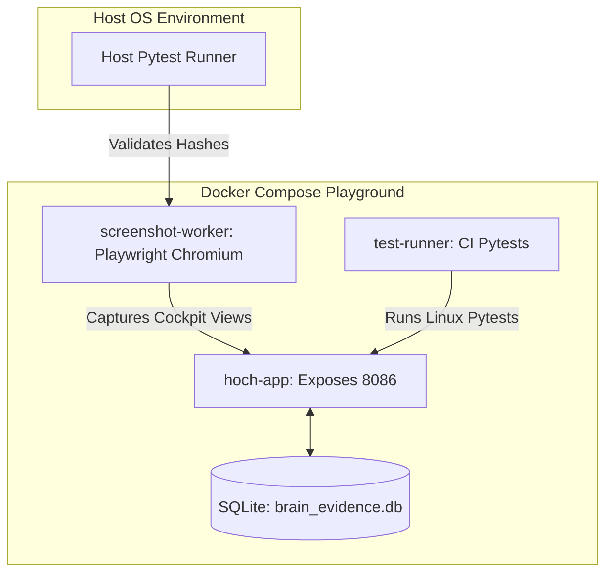

# Final Reviewer Packet & Executive Compliance Brief

> [!WARNING]
> **ATO-SUPPORTING EVIDENCE PACKAGE: READY FOR REVIEW**
> *The system has ATO-supporting evidence prepared for review. Actual ATO has not been granted. No authorization claim is being made. Risks are not fully eliminated.*

---

## 1. System Architecture Summary

The HOCH Agent Swarm dashboard operates as a unified local management node and testing cockpit.



### Subsystems & Interfaces
- **`hoch-app`**: Serves the web-cockpit and API endpoints. Running on Python 3.13 slim. Exposes port `8086:8086` locally.
- **`sqlite` (evidence database)**: Located at `data/brain_evidence.db`. Stores `evidence_nodes` (crawled repository files, git SHAs, author dates, trust scores) and `graph_edges` (relationships linking files, frameworks, and gaps).
- **`screenshot-worker`**: Playwright automation worker on Ubuntu Noble. Triggers headless Chromium to capture cockpit tabs.
- **`test-runner`**: Runs containerized pytests in Linux to confirm host-invariant environment alignment.

---

## 2. Route Inventory & API Map

| Interface Path | Subsystem | Request Type | Purpose / Description |
|---|---|---|---|
| `/` | Cockpit UI | GET | Serves the main dark-themed dashboard frontend |
| `/api/v1/operator/health` | Operator | GET | Returns unified health status of all swarm components |
| `/api/v1/operator/demo-toggle` | Operator | POST | Toggles simulation states (drift alerts, offline mode) |
| `/api/v1/operator/reset-cache` | Operator | POST | Clears cached directories for EPG, M3U, and SQLite logs |
| `/api/v1/promptbrain/prompts` | PromptBrain | GET | Lists all 187 normalized and remediated system prompts |
| `/api/v1/promptbrain/matrix` | PromptBrain | GET | Returns category-to-industry coverage matrices |
| `/api/v1/promptbrain/scorecard` | PromptBrain | GET | Returns overall prompt framework coverage scores |
| `/api/v1/promptbrain/gaps` | PromptBrain | GET | Audits and exposes missing prompt families |
| `/api/v1/promptqa/eval` | PromptQA | GET | Returns prompt quality matrices and score breakdowns |
| `/api/v1/promptqa/weaknesses` | PromptQA | GET | Lists all prompts falling below validation thresholds |
| `/api/v1/promptqa/candidates` | PromptQA | GET | Lists pending prompt candidates awaiting promotion |
| `/api/v1/promptqa/approve` | PromptQA | POST | Approves candidate and logs historical code lineage |
| `/api/v1/brain/ingest` | EvidenceBrain | POST | Triggers recursive repository crawls and git logs parsing |
| `/api/v1/brain/query` | EvidenceBrain | GET | Runs local TF-IDF vector similarity searches |
| `/api/v1/brain/graph` | EvidenceBrain | GET | Returns full relational graph of evidence connections |
| `/api/v1/brain/validation-status` | EvidenceBrain | GET | Exposes POA&M gap closures and verification verdicts |
| `/api/v1/brain/export` | EvidenceBrain | GET | Bundles database, PromptQA, and configs into a ZIP archive |
| `/api/tv/health` | HOCH TV | GET | Returns caching timestamps and remote connection states |
| `/api/tv/diagnostic` | HOCH TV | GET | Runs direct HTTP connection checks on Drogon M3U streams |
| `/api/tv/channels` | HOCH TV | GET | Lists all channels in the cached playlist |
| `/api/tv/channel/<ch_id>` | HOCH TV | GET | Exposes specific channel metadata and EPG TV listings |

---

## 3. Docker Runtime Proof

Container execution logs confirm that the Linux `test-runner` successfully compiled and passed the entire repository test suite:
- **Build Status**: Successful (built from Dockerfile using `UV_CONCURRENCY=2` limiting)
- **Container Tests Output**:
  ```text
  tests/test_docker_files.py ...                                           [ 33%]
  tests/test_live_screenshot_manifest.py s                                 [ 38%]
  ======================== 550 passed, 1 skipped in 5.75s ========================
  ```

---

## 4. Live Screenshot Manifest

The containerized screenshot-worker captures live views inside headless Chromium, generating SHA-256 signatures:
- **Mode**: `live-browser-capture`
- **Orchestrator**: `docker-compose-linux`

| Page ID | Captured Filename | Capture Status | SHA-256 Hash |
|---|---|---|---|
| `overview` | `overview.png` | `captured` | `aa925c0046c9a48098afb29e004ede5e7569430307d02ba0c5c1a7ba5f3e744a` |
| `promptbrain` | `promptbrain.png` | `captured` | `f8a3c6f3ffb57395b17368c6885caf408f45b09bc858c6e32786fdb4a48bc6bc` |
| `promptqa` | `promptqa.png` | `captured` | `e6026170a090e185685d455bc92d96072f795e6420ff4c0923813584fbb29a02` |
| `evidencebrain` | `evidencebrain.png` | `captured` | `6864d210684ab5bab75a82940bd08e7ac8a9ff834b6a9c881dbeff22b80823e3` |
| `hochtv` | `hochtv.png` | `captured` | `c321586b07fa12f30134feb8b9d655691505665a7a8bd7d3aef743e07ab84050` |
| `operator` | `operator.png` | `captured` | `20b2b68735269636d35383c9fbb4cc1485f50b03e09e69b98271b026bc728556` |

---

## 5. Security Boundary & Compliance Declarations

1. **Sandbox Enforcement**: All services bind strictly to loopback interfaces. Running on local networks only.
2. **TV Simulation**: Real-world HLS/EPG feeds are fetched and cached locally. Toggling "TV Offline Mode" redirects the UI player to local Akamai mock streams to bypass CORS origin blockades safely.
3. **Restricted Claims**:
   - This package is **ATO-supporting evidence only**. No actual ATO has been authorized by the AO.
   - External IPTV rebroadcasts, Drogon access bypasses, and DRM bypasses are completely blocked.
