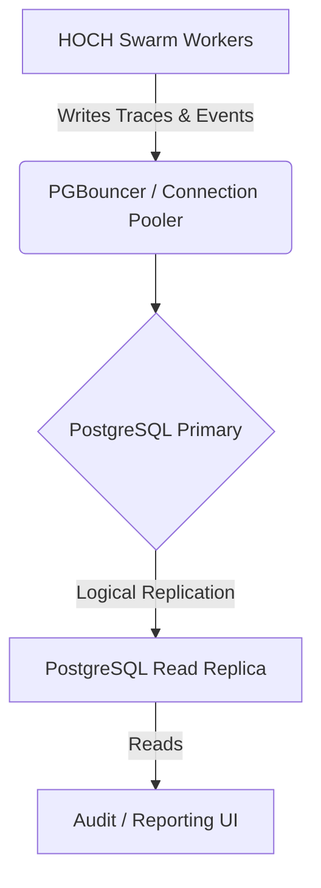

# HOCH Swarm Control: Database Migration Plan

This document establishes the official decision rules and migration path from SQLite to PostgreSQL for the immutable ledger store.

---

## 1. Migration Decision Matrix

SQLite with Write-Ahead Logging (WAL) is the default embedded database engine for local control planes. The platform must migrate the database engine to PostgreSQL when any of the following threshold conditions are met:

| Metric | SQLite WAL (Default) | PostgreSQL (Target) | Action Required |
| :--- | :--- | :--- | :--- |
| **Topology Scale** | Single control-plane instance | Multi-node distributed control plane | **Migrate** |
| **Write Concurrency** | Single operator write stream | Concurrent writes from multiple worker pods | **Migrate** |
| **Write Pressure** | < 50 audit events / sec | > 50 audit events / sec sustained | **Migrate** |
| **Database Locked Events** | 0 events (handled by busy_timeout) | > 2 unhandled `OperationalError` events / 24h | **Migrate (P0 Issue)** |
| **Compliance standard** | Local storage / development | Multi-tenant audit trail with isolation | **Migrate** |

---

## 2. PostgreSQL Target Architecture



### Key Target Specifications:
- **Connection Pooling**: PgBouncer configuration (transaction mode pooling) to handle swarm worker connections.
- **Table Partitioning**: Partition the `ledger_blocks` table monthly on the `timestamp` column to maintain fast query response times under high volumes.
- **Replication**: Active-passive hot standby replication for disaster recovery.

---

## 3. Schema Mapping & Migration Steps

### A. DDL Translation
The SQLite ledger schema is translated to PostgreSQL as follows:

```sql
-- SQLite
CREATE TABLE ledger_blocks (
    idx INTEGER PRIMARY KEY,
    timestamp TEXT NOT NULL,
    event_id TEXT NOT NULL UNIQUE,
    event TEXT NOT NULL,
    previous_hash TEXT NOT NULL,
    hash TEXT NOT NULL
);

-- PostgreSQL Target
CREATE TABLE ledger_blocks (
    idx BIGSERIAL PRIMARY KEY,
    timestamp TIMESTAMP WITH TIME ZONE NOT NULL,
    event_id VARCHAR(64) NOT NULL UNIQUE,
    event JSONB NOT NULL,
    previous_hash CHAR(64) NOT NULL,
    hash CHAR(64) NOT NULL
);
CREATE INDEX idx_ledger_timestamp ON ledger_blocks (timestamp);
```

### B. Migration Pipeline (Zero-Downtime)
1. **Provision Target**: Deploy PostgreSQL instance matching production posture.
2. **Double-Write Phase**: Update `backend/ledger_manager.py` to write asynchronously to PostgreSQL while keeping SQLite as the primary source of truth.
3. **Data Sync**: Dump existing SQLite ledger rows using `sqlite3` dump utilities, transform statements to PostgreSQL syntax, and load them into Postgres.
4. **Validation Phase**: Run cryptographic chain validations over both databases to assert hash integrity.
5. **Switchover**: Deploy backend configuration setting PostgreSQL as the primary ledger engine, deprecating SQLite writer.
