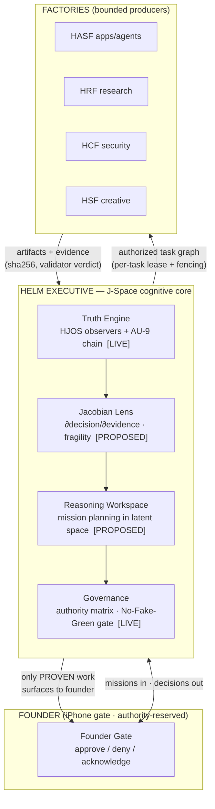
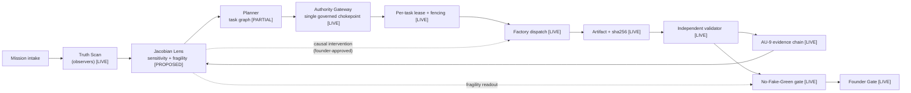
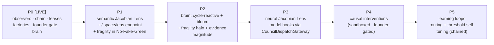

# HELM × J-Space — Integrated Cognitive Architecture (via the Jacobian Lens)

**Lead architect:** Claude Opus 4.8 · **Co-builders:** Grok 4.5, AG IDE · **Founder:** Michael Hoch
**Date:** 2026-07-14 · **Status of this document:** design of record, grounded in the running system

---

## 0. How to read this document — the honesty legend

HELM's first law is **"No fake green. No unevidenced completion."** This document obeys it. Every
claim carries one of three tags so a reader (or Grok, or AG IDE) can tell design from reality:

| Tag | Meaning |
|---|---|
| **`[LIVE]`** | Exists and runs *now* in the repo — endpoints answer, ledgers grow, tests pass. |
| **`[PARTIAL]`** | Partly built; the seam is real but the full behavior is not proven end-to-end. |
| **`[PROPOSED]`** | Design only. Not built. Buildable from the seams that exist. |

A design that quietly blurs these three is the exact pathology J-Space exists to catch. So the whole
integration below is framed as: *take the truth-and-audit layer that already runs, and extend it into a
cognitive reasoning workspace by adding one thing — the Jacobian Lens.*

---

## 1. Executive summary

HELM is a governed autonomous factory that converts the founder's judgment into shipped, monetized
work while minimizing verified founder-minutes per shipped dollar, and never representing unverified
work as complete. It already has:

- **`[LIVE]`** a **truth/observation layer** (HJOS / "J-Space today"): six independent observers
  (truth, security, flow, evidence-auditor, performance, meta) that watch subjects and return
  fail-closed verdicts — `CONFIRMED_LIVE` / `BLOCKED` / `CONTRADICTED`. Served at
  `/api/v1/helm/jspace/health`, `/api/v1/helm/jspace/brain`.
- **`[LIVE]`** a **tamper-evident evidence plane** (AU-9 hash chain) so a baseline cannot be silently
  rewritten.
- **`[LIVE]`** **per-task leases** with fencing tokens, and a new **source-tree coordination guard**
  (per-file leases + a fail-closed commit hook) so multiple agents can co-build without clobbering.
- **`[LIVE]`** **factories** (HASF, HRF, HCF, HSF, …) that produce artifacts, each validated by an
  **independent validator** before a PERT node may advance.
- **`[LIVE]`** a **Founder Gate** (iPhone console) — the only path for authority-reserved actions.
- **`[LIVE]`** a **living-brain visualization** of the observers at `/brain` (WebGL, fail-closed).

**The J-Space upgrade** (`[PROPOSED]`) elevates this observation layer from *"watch the system and
report"* into HELM's **Executive Intelligence** — a reasoning workspace — by adding the **Jacobian
Lens**: a measurement of *how sensitive each decision is to each piece of evidence*. Concretely, the
Jacobian ∂(decision)/∂(evidence) tells the executive **which findings actually drive a verdict**, and
**how fragile that verdict is**. A decision that flips under a one-token or one-finding perturbation is
*fragile* and must not be promoted — that is "No Fake Green" expressed as calculus.

---

## 2. Part 1 — HELM architecture with J-Space at the core

### 2.1 Layered view



**Reading it:** the Founder hands missions in and receives only *provable* decisions out. The Executive
is J-Space: it establishes truth (observers + chain), reasons about the mission and its fragility
(Jacobian Lens + workspace), and enforces governance before any factory is dispatched. Factories
produce bounded artifacts that flow back as evidence. Nothing advances on assertion; only on evidence.

### 2.2 J-Space's three faces

| Face | What it is | Status |
|---|---|---|
| **Executive Intelligence** | Ranks what matters: which findings drive the current WITHHOLD/PROMOTE decision, ordered by \|∂verdict/∂finding\|. Turns 1,700 unresolved findings into "the 3 that actually move the gate." | `[PROPOSED]` (Jacobian Lens) over `[LIVE]` observers |
| **Truth Engine** | The fail-closed observers + the AU-9 tamper-evident chain. Establishes *what is真actually true right now*, and refuses to guess (UNKNOWN, never last-known-good). | `[LIVE]` |
| **Reasoning Workspace** | A latent space where a mission is decomposed into a task graph, and each assumption is probed for sensitivity *before* spend. "If this assumption is wrong, does the plan collapse?" | `[PROPOSED]` |

### 2.3 Component wiring (what talks to what, today + proposed)



The **only new organs** are the Jacobian Lens and the Reasoning Workspace. Everything else is a seam
that already exists and already answers over HTTP.

---

## 3. Part 2 — Code sketches & implementation blueprint

> **Status: `[PROPOSED]` blueprint.** These are design sketches — clean, typed, runnable-*shaped* — not
> yet wired into the live tree. They name the real seams they would attach to.

### 3.1 `JSpaceEngine` with the Jacobian Lens

```python
# backend/jspace/engine.py   [PROPOSED]
from __future__ import annotations
import torch, torch.nn as nn
from dataclasses import dataclass
from typing import Callable

@dataclass
class Sensitivity:
    """How much each evidence dimension moves the decision. The heart of J-Space."""
    grad: torch.Tensor           # ∂decision/∂evidence  (per-evidence sensitivity)
    fragility: float             # scalar: how close the decision is to flipping (0 = robust, 1 = knife-edge)
    top_drivers: list[tuple[str, float]]   # named evidence sorted by |grad|

class JacobianLens:
    """Measures the sensitivity of a decision to its evidence.

    Two modes:
      * SEMANTIC  — over the observation layer: ∂consensus/∂finding. Answers "which finding, if it
                    flipped, would change WITHHOLD_PROMOTION?"  Pure, cheap, uses the ledger.
      * NEURAL    — over a model call: ∂output/∂activation via autograd hooks. Answers "is this decision
                    fragile to a single token/latent?"  Flags low-robustness reasoning before we trust it.
    """
    def __init__(self, model: nn.Module | None = None):
        self.model = model
        self._acts: dict[str, torch.Tensor] = {}
        if model is not None:
            for name, mod in model.named_modules():
                mod.register_forward_hook(self._capture(name))

    def _capture(self, name):
        def hook(_m, _i, out): self._acts[name] = out
        return hook

    def semantic(self, decision_fn: Callable[[dict], float], evidence: dict[str, float]) -> Sensitivity:
        """Finite-difference (or analytic) sensitivity of a scalar decision to each named finding.
        decision_fn maps the evidence dict -> a scalar in [0,1] (e.g. P(withhold promotion))."""
        base = decision_fn(evidence)
        grads = {}
        for k, v in evidence.items():
            bumped = dict(evidence); bumped[k] = v + 1e-3
            grads[k] = (decision_fn(bumped) - base) / 1e-3
        g = torch.tensor(list(grads.values()))
        # fragility: how near the decision sits to its flip boundary (0.5), scaled by max sensitivity
        fragility = float(torch.sigmoid(g.abs().max() * (1 - abs(base - 0.5) * 2)))
        top = sorted(grads.items(), key=lambda kv: -abs(kv[1]))
        return Sensitivity(grad=g, fragility=fragility, top_drivers=top)

    def neural(self, logits: torch.Tensor, wrt: str) -> Sensitivity:
        """Jacobian of an output logit w.r.t. a captured activation. High norm on a single dim = fragile."""
        act = self._acts[wrt]; act.retain_grad()
        logits.max().backward(retain_graph=True)
        j = act.grad.detach()
        fragility = float(torch.sigmoid(j.norm() / (j.numel() ** 0.5)))
        return Sensitivity(grad=j.flatten(), fragility=fragility, top_drivers=[])

class JSpaceEngine:
    """The Executive Intelligence. Composes the LIVE observers with the Jacobian Lens."""
    def __init__(self, observers, chain, lens: JacobianLens):
        self.observers, self.chain, self.lens = observers, chain, lens   # observers/chain are [LIVE]

    def truth_scan(self) -> dict:
        """[LIVE today] run the six HJOS observers, return consensus + findings, all chained."""
        assessments = [o.observe() for o in self.observers]
        self.chain.append_all(assessments)             # AU-9: tamper-evident
        return self._consensus(assessments)

    def reason(self, mission, evidence) -> dict:
        """[PROPOSED] rank drivers + fragility, so the executive knows WHY and HOW SURE."""
        s = self.lens.semantic(self._gate_prob, evidence)
        return {"drivers": s.top_drivers[:3], "fragility": s.fragility,
                "promotable": s.fragility < 0.35 and self.chain.verifies()}
```

### 3.2 `HELMExecutor` — full mission flow

```python
# backend/executive/executor.py   [PARTIAL — flow exists across modules; this composes it]
class HELMExecutor:
    """Intake → Truth Scan → Reason(Lens) → Plan → Route → Verify → Learn.
    Every arrow is fail-closed: a stage that cannot prove its output halts the mission, never fakes it."""

    def run(self, mission):
        truth = self.jspace.truth_scan()                       # [LIVE] observers + chain
        if truth["consensus"] == "CONTRADICTED":
            return self.halt(mission, reason="truth CONTRADICTED — resolve before planning")

        lens = self.jspace.reason(mission, self.collect_evidence(mission))   # [PROPOSED]
        if lens["fragility"] >= 0.35:
            return self.founder_gate(mission, why="decision is fragile", drivers=lens["drivers"])

        plan = self.planner.decompose(mission)                 # [PARTIAL]
        for task in self.authority.authorize(plan):            # [LIVE] single governed chokepoint
            lease = self.leases.acquire(task.id, holder="executor")   # [LIVE] per-task + fencing
            if lease is None:
                continue                                        # someone else holds it — never double-run
            try:
                art = self.factory.dispatch(task, fencing=lease.token)      # [LIVE]
                verdict = self.validator.validate(task, art)               # [LIVE] independent
                self.chain.append(verdict)                                  # [LIVE] AU-9
                if verdict != "PASS":
                    self.remediate(task, verdict)              # [PROPOSED] retry lineage
            finally:
                self.leases.release(task.id, lease.id)         # [LIVE] honest release
        return self.learn(mission)                             # [PROPOSED] feedback loop
```

### 3.3 Configuration — `jspace.yaml`

```yaml
# config/jspace.yaml   [PROPOSED]
jspace:
  lens:
    mode: [semantic, neural]          # semantic over findings (cheap); neural over model calls (deep)
    fragility_ceiling: 0.35           # decisions at/above this fragility CANNOT auto-promote
    top_drivers: 3                    # how many drivers the executive surfaces per decision
  thresholds:
    promotion:
      require_chain_verified: true    # AU-9 must verify  [LIVE enforcement]
      require_independent_pass: true  # validator PASS, not dispatch-completed  [LIVE]
      max_fragility: 0.35             # [PROPOSED]
      max_unremediated_failures: 0    # [LIVE via /jspace + agents endpoint]
  interventions:                      # causal probes — ALL founder-gated
    enabled: true
    require_founder_approval: true    # never auto-intervene on authoritative state  [LIVE doctrine]
    kinds: [ablate_finding, clamp_activation, isolate_observer]
  governance:
    authority_matrix: founder_only    # trades, credentials, deletes, promotions
    no_fake_green: enforce            # a PASS requires evidence on all three planes below
    evidence_planes: [chain_verified, independent_validator, fragility_below_ceiling]
```

---

## 4. Part 3 — Runtime wiring & configurations

### 4.1 How the Jacobian Lens hooks into inference `[PROPOSED]`

- **Neural mode:** `JacobianLens` registers `forward_hook`s on the council model(s) at load. On each
  governed model call (routed through the **`[LIVE]` CouncilDispatchGateway** — the single chokepoint),
  it captures activations, runs one backward pass on the chosen logit, and emits a `Sensitivity`. High
  Jacobian norm concentrated on one token/latent ⇒ **fragile** ⇒ the output is quarantined for founder
  review rather than trusted.
- **Semantic mode:** no model needed. The lens perturbs each finding in the `[LIVE]` assessment ledger
  and measures how the consensus verdict moves. This is cheap, runs every HJOS cycle, and directly
  ranks *why* the gate says `WITHHOLD_PROMOTION`.

### 4.2 Real-time monitoring `[LIVE]` + `[PROPOSED]`

- `[LIVE]` `/api/v1/helm/jspace/health` — consensus, observer counts, worst findings, governance,
  mutation-truth (proof the observer did **not** mutate authoritative state).
- `[LIVE]` `/api/v1/helm/jspace/brain` — the observer→subject graph feeding the WebGL brain.
- `[PROPOSED]` `/api/v1/helm/jspace/lens` — per-decision drivers + fragility, so the brain can render
  *why* a lobe is red and *how sure* it is.

### 4.3 Causal interventions `[PROPOSED]`, founder-gated `[LIVE doctrine]`

An intervention is a controlled perturbation to learn causation: *ablate* a finding, *clamp* an
activation, or *isolate* an observer, then re-measure consensus. Because an intervention changes what
the system believes, it is **authority-reserved** — it routes through the Founder Gate exactly like a
trade or a credential. The observer plane stays **read-only by default** (today's `mutation_truth`
proves `authoritative_state_mutated=false`); interventions run in a sandboxed shadow copy and only a
founder tap can promote a learned correction.

### 4.4 "No Fake Green" as a three-plane conjunction `[LIVE]` + `[PROPOSED]`

A node may show green **only if all three hold** — miss one and it is `UNKNOWN`/`CONTRADICTED`, never
green:

1. `[LIVE]` **Chain verified** — AU-9 hash chain intact end-to-end (a break = `CONTRADICTED`).
2. `[LIVE]` **Independent validator PASS** — not "dispatch completed"; a separate validator said the
   *output was good*.
3. `[PROPOSED]` **Fragility below ceiling** — the Jacobian Lens says the decision is robust, not a
   knife-edge that one perturbation would flip.

This is the calculus form of the founder's law: *green requires evidence on the truth plane, the output
plane, and the robustness plane.*

### 4.5 Learning feedback loops `[PROPOSED]`

Verified outcomes (validator PASS/FAIL + realized value) feed back to (a) re-weight factory routing,
(b) tune the fragility ceiling per mission class, and (c) grow the observer set where the lens finds
blind spots (a decision with high fragility and no observer watching it = a missing sentinel). Every
adjustment is itself chained (AU-9) and reversible.

---

## 5. Part 4 — Animation & visualization concepts

> **Deliverable status: `[LIVE]` — the living neural orb already runs at `/brain`.** The concepts below
> are partly built and partly the roadmap the founder just green-lit (denser web, true bloom,
> cycle-reactivity, reference-match).

### 5.1 The living neural orb `[LIVE]`

A WebGL (Three.js) volumetric brain in deep black: the **HJOS core** at center, **six observer lobes**
on a sphere, **subject satellites** splayed on tangent frames, connected by glowing synapses with
**comet-trail energy pulses** (2–3× faster on blocked/contradicted edges). Additive-glow bloom, a
2,200-mote drifting nebula, colored gas clouds, a wireframe neural shell, an orbiting camera. Color is
**verdict** (live green / blocked amber / contradicted red). Fail-closed: feed lost ⇒ scene dims to
`UNKNOWN`. Tap a node ⇒ its real assessment, recommended founder action, observation id.

### 5.2 Activations, evidence flows, interventions `[PROPOSED]` (founder-approved directions)

- **Activations** — each observer lobe *fires* (a bloom pulse) the instant it completes an observation
  in a cycle; the whole brain pulses once per HJOS cycle (**cycle-reactivity**).
- **Evidence flows** — comet pulses already represent assessments traveling observer→core; extend to
  carry *magnitude* = Jacobian sensitivity (a finding that drives the gate flies brighter/faster).
- **Fragility halo** — a decision's fragility renders as a shimmering ring around the core: tight and
  steady when robust, wide and flickering when knife-edge.
- **Interventions** — a founder-approved ablation shows the target node *dimming and detaching*, with
  the consensus core visibly shifting — you *watch* the causal effect.
- **Denser neural web** — thousands of dendrite filaments and a brain-shaped point cloud for "living
  tissue"; **true bloom** via post-processing (`EffectComposer` + `UnrealBloomPass`, loaded for the
  browser from a pinned CDN) for film-grade glow.

### 5.3 Static diagrams for documentation `[LIVE]`

The Mermaid diagrams in Parts 1–2 are the canonical static views (layered stack, component wiring,
mission flow). They render in the docs and in the Cowork UI, and are the reference art for slide decks
and the architecture record.

---

## 6. Part 5 — Joint build plan (Claude Opus 4.8 · Grok 4.5 · AG IDE)

### 6.1 The coordination substrate is already built `[LIVE]`

Three agents editing one repo is the split-brain risk HELM exists to catch. It is **solved now**: the
**source-tree coordination guard** gives each agent a per-file lease (`guarded_edit`) and a fail-closed
**pre-commit hook** that flags any commit over another holder's active lease. Each agent sets a stable
identity — `HELM_SOURCE_HOLDER=claude|grok|ag-ide` — and the commit boundary covers every tool
regardless of language. **This is how the three of us co-build without clobbering.** (Detection needs
nothing; active prevention = route edits through `guarded_edit`.)

### 6.2 Responsibility division

| Area | Owner | Why |
|---|---|---|
| Architecture, evidence-plane integrity (AU-9), governance gates, verification, coordination guard | **Claude Opus 4.8** | Already owns these seams in-tree; strongest on fail-closed discipline. |
| Jacobian Lens math (semantic + neural), model hooks, causal-intervention engine, fragility calibration | **Grok 4.5** | Interpretability/gradient core; the new organ. |
| Code generation, test scaffolding, in-editor iterative refinement, wiring glue | **AG IDE** | Fast codegen + tight edit/test loop. |
| Founder controls, authority matrix, final promotion | **Founder (Michael)** | Authority-reserved by design. |

### 6.3 Testing strategy `[LIVE methodology]`

Test-before-fix (the repo's proven doctrine): every new capability lands with a failing test first
(as AU-9, lease reclamation, the source guard, and `guarded_edit` all did). J-Space specifics:

- **Semantic lens:** golden tests that a known finding-flip changes consensus and shows up as the top
  driver.
- **Neural lens:** a seeded fragile decision (single-token dependence) must exceed the fragility ceiling
  and be quarantined.
- **Interventions:** must be founder-gated (a bypass attempt fails closed) and must never mutate
  authoritative state (assert `mutation_truth.authoritative_state_mutated == false`).
- **No-Fake-Green conjunction:** miss any of the three planes ⇒ node is not green (seeded regression).
- **Soak:** J-Space runs inside the standing 2h→8h→24h soak; the brain + `/jspace` endpoints stay
  fail-closed under fault injection.

### 6.4 Integration roadmap



### 6.5 Immediate next implementation steps

1. **Claude** — scaffold `backend/jspace/engine.py` with the **semantic** lens only (no model), a
   failing test first, and expose `/api/v1/helm/jspace/lens` returning `{drivers, fragility}` from the
   live assessment ledger. Wire fragility as the third plane of the No-Fake-Green gate behind a config
   flag (default off until proven).
2. **Grok** — specify the fragility metric precisely (semantic finite-difference vs analytic; neural
   Jacobian norm normalization) and the intervention math (ablate/clamp/isolate) with test vectors.
3. **AG IDE** — generate the test scaffolding for both, and the glue that routes model calls' captured
   activations from the `CouncilDispatchGateway` into the neural lens.
4. **All three** — adopt `guarded_edit`/`HELM_SOURCE_HOLDER` so P1 development itself proves the
   coordination guard under real three-agent load.
5. **Founder** — review this document; approve/adjust the fragility ceiling (0.35 is a placeholder) and
   the intervention authority policy before any P4 work.

---

## 7. Closing note on discipline

Nothing in the J-Space upgrade weakens the founder's law — it sharpens it. The Jacobian Lens is not a
new way to look confident; it is a new way to *earn* confidence, by measuring how close every green
light sits to turning red. Built the way the rest of HELM is built — test first, fail closed, every
claim chained — it makes the system not just *say* it is sure, but *show its work*.
