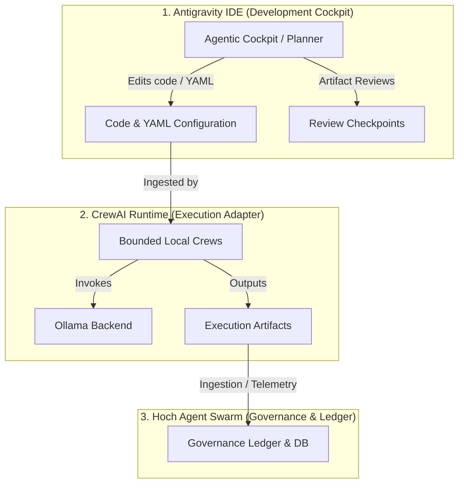

# Google Antigravity & CrewAI Integration Doctrine
## Hoch Agent Swarm Development & Execution Layer

This document outlines the architectural division, development workflow, and safety regulations for integrating Google Antigravity as the external agentic development cockpit with CrewAI as the bounded local multi-agent execution adapter.

---

### 1. Separation of Concerns & Architecture



- **Google Antigravity**: Acts as the agentic development cockpit. It operates across the editor, terminal, and browser, planning implementation steps, performing code edits, generating task specifications, and conducting artifact-based reviews.
- **CrewAI**: Serves as a local bounded execution adapter. It runs deterministically, executing crews defined by static YAML configs. It does not act as a parallel source of truth but rather as a bounded sandbox adapter.
- **Ollama**: Exposes the local inference model endpoint (e.g. `ollama/llama3.1`) to service the local execution adapter.
- **Hoch Agent Swarm**: Governs the broader runtime, managing device discovery, lease management, capability routing, approval gates, and ingestion of evidence packages.

---

### 2. Workflow: Design, Review, and Promotion

1. **Planning**: Antigravity evaluates the request and generates a formal execution/implementation plan.
2. **Configuration**: Antigravity updates the static `agents.yaml` and `tasks.yaml` definitions within the local CrewAI project structure.
3. **Review**: Operator inspects the changes to confirm that the agent backstories, goals, and task descriptions conform to the platform's safety guidelines.
4. **Execution**: The local crew is kicked off deterministically using the bounded runtime:
   ```bash
   crewai run
   ```
5. **Promotion**: On successful run completion, output files are written to the `artifacts/crew_runs/` directory and subsequently ingested by the Hoch Agent Swarm process runtime as signed evidence packages.

---

### 3. YAML Task Conversion Guidelines

When translating agent task definitions into CrewAI YAML configs:
- Every task must strictly reference a single approved agent.
- Tasks must define clear, deterministic `expected_output` formats.
- Task dependencies must be explicitly defined using the `context` parameter pointing to existing tasks to avoid out-of-order execution.

---

### 4. Safety Gates & Restrictive Actions

To prevent uncontrolled agent spawning, infinite loops, and credential exposure, the following invariants are enforced:
- **No Unbounded Agents**: Agents cannot spawn new subagents dynamically during execution. The crew structure remains statically bounded by the YAML config.
- **Hard Execution Limits**: Every crew kickoff must enforce a maximum task depth and delegation cap.
- **Human Approval Gates**: Operator manual overrides are required for:
  - File writes outside the project root directory.
  - Shell commands that mutate file systems.
  - Network request calls.
  - Credential access or deployment actions.
- **No Secrets Logging**: The loggers must scrub and never print secrets or environment variables.

---

### 5. Extendability: Antigravity SDK/CLI Hooks

Future integrations of Antigravity (e.g., custom hooks or sidecars) can be added without mutating the CrewAI core by subscribing to standard output files generated inside `artifacts/crew_runs/`. The integration is loose-coupled: CrewAI executes, writes JSON reports, and Antigravity reads those outputs to verify compliance, track execution progress, and visualize data on the Swarm Dashboard.
