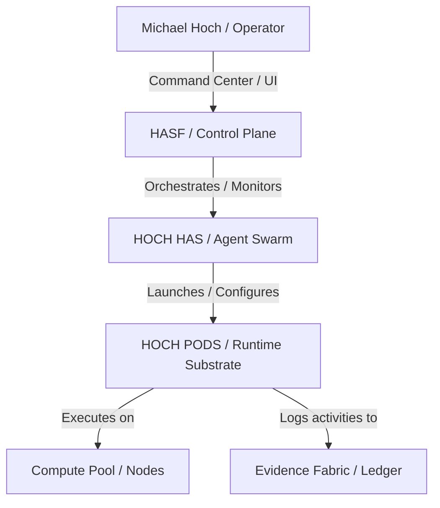

# HOCH PODS Secure Agent Runtime Architecture

This document defines the architecture, design principles, and secure runtime boundaries of **HOCH PODS**, the primary secure compute and runtime substrate underneath the **HOCH Agent Swarm (HOCH HAS)** and the **HOCH Agent Swarm Framework (HASF)**.

---

## 1. HOCH PODS Definition
**HOCH PODS** is a secure, local-first, zero-trust containerized execution framework designed specifically for autonomous AI agents. A "Pod" represents an isolated, single-tenant, policy-enforced runtime instance where an agent executes a defined mission using scoped models, tools, and compute nodes. 

HOCH PODS guarantees that:
- Agent actions are constrained to authorized APIs and tools.
- All runtime actions produce cryptographic and immutable evidence.
- Resources (CPU, memory, networking) are strictly governed.

---

## 2. System Relationships

### 2.1 Relationship with HOCH HAS
HOCH HAS (Agent Swarm Layer) acts as the logic, routing, and cognitive engine. It parses the mission, selects the appropriate agent type, and determines the workflow. HOCH PODS serves as the physical execution substrate. HAS cannot execute code, query databases, or call APIs directly; it must request a Pod to be summoned to perform these tasks inside a protected environment.

### 2.2 Relationship with HASF
HASF (Framework & Control Plane) is the management and monitoring plane. It exposes the PERT Command Center, validates telemetry, ensures data freshness, and verifies the system posture. HASF acts as the Policy Decision Point (PDP) and Policy Enforcement Point (PEP) for HOCH PODS, monitoring lifecycle transitions and checking for compliance violations.

---

## 3. Compute Node Roles & Topology

HOCH PODS runs on a tiered, hybrid compute pool configured as a local-first topology:

| Node | OS / Specs | Role in Swarm | Compliance Trust Zone |
| --- | --- | --- | --- |
| **M5 Pro MBP** | macOS / 24 GB / 1 TB | Primary Control Node, HAS Orchestrator, UI Host | Management Zone |
| **M4 MBP** | macOS / 16-32 GB / 1 TB | Secondary Inference & Builder Node, Local Models | Model Zone |
| **iMac 24** | macOS / 24 GB / 512 GB | Build & Verification Worker, Test Runner | Tool Execution Zone |
| **Dell Latitude 9440** | Windows/Linux / 32 GB / 1 TB | Security / QA Worker, SAST/DAST scanner | Tool Execution Zone |
| **Docker / k3d / Compose** | Linux VM / Ephemeral | Isolated runtime sandbox for untrusted scripts | Pod Runtime Zone |
| **Optional Cloud/VPS** | Ubuntu / Remote | Uptime workload extension, Fall-Closed | Optional Remote Zone |

---

## 4. Zero Trust & Hardening Architecture

### 4.1 Zero Trust Assumptions (NIST SP 800-207)
HOCH PODS is architected on three core Zero Trust principles:
1. **Verify Explicitly**: Every access request (by operator, agent, or pod) is authenticated, authorized, and validated.
2. **Use Least Privilege**: Pods are bound to the smallest possible model, the exact list of tools required, and specific network ports.
3. **Assume Breach**: Network segments are isolated (micro-segmentation), traffic is encrypted, and telemetry is monitored continuously for anomalies.

### 4.2 Default-Deny Network Model
All network interfaces for HOCH PODS default to a fail-closed status:
- Inbound access to Pod runtimes is blocked by default.
- Outbound access is restricted to whitelisted API endpoints (e.g., local model providers, Supabase, Stripe).
- Optional remote compute nodes must use secure, point-to-point tunnels (e.g., Tailscale, Cloudflare Tunnels) with strict access control lists (ACLs).

### 4.3 Secrets Handling Model
- **Zero Secrets in Source**: No API keys, credentials, or passwords are committed to git repositories or stored in plaintext `.env` files.
- **Local Secret Vault**: Secrets are injected into Pod runtimes dynamically at the time of summoning using secure environment injections or local encrypted vaults.
- **Rotation & Isolation**: Vault credentials are bound to specific host IDs and are inaccessible across different trust zones.

### 4.4 Evidence Fabric Integration
To prevent tampered logs, the HOCH PODS runtime integrates with the **HASF Evidence Fabric**:
- Every transition of a pod's lifecycle (from `SUMMONING` to `COMPLETE`) writes a heartbeat and audit payload to the evidence ledger.
- Verification status is regularly compiled into MD evidence reports (`docs/evidence/runtime/`).
- Stale or missing evidence triggers an immediate state transition to `BLOCKED` or `FAILED`.
