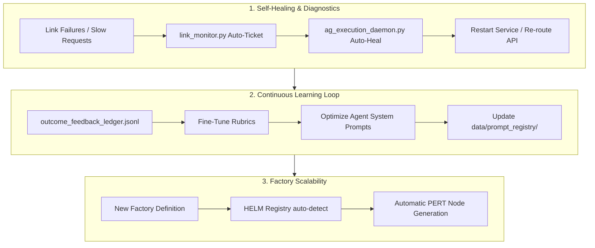

# HELM Tailscale Relay Audit & Architectural Growth Plan
**Date**: 2026-07-09 · **Host**: `https://hoch-relay-001.tail826763.ts.net:3012/` (IP: `100.87.18.15`) · **Status**: 16/16 Active Routes 🟢 GREEN

This document presents a comprehensive audit of the Tailscale-internal HELM relay endpoints and active space-control surfaces. It outlines what each endpoint provides, its benefits, and concrete strategic improvements to enhance, elevate, and scale HELM's multi-agent factories, self-healing diagnostics, and continuous learning systems.

---

## 1. HELM Relay & Interface Audit

| Endpoint / Link | Type | What it Provides | Operational Benefit | Growth & Enhancement Options |
|:---|:---|:---|:---|:---|
| `/health` | JSON | Live worker ID, hostname, container status, and UTC timestamp. | Simplest heartbeat validation for network uptime monitoring. | **Enhance**: Return current system resource utilization (CPU, memory, disk IO) directly to allow fast failure cascades. |
| `/` | HTML | Main entry point for the HELM management console. | Centralized routing for operator control. | **Elevate**: Implement automatic theme sync, client-side caching of static templates, and single-page-app layout transitions. |
| `/control` | HTML | Live dashboard displaying the PERT graph, active project gaps, coordination logs, and loop states. | Visual center-of-gravity for monitoring task completion rates. | **Grow**: Add interactive node drag-and-drop to manually override PERT scheduling constraints on-the-fly. |
| `/board` | HTML | Jira-style Kanban board displaying the status of swarm-derived tickets and epics. | Clear division of labor between agent sub-systems and operator tasks. | **Self-Heal**: Allow agents to auto-resolve blockers when validation test suites pass, directly moving tickets to DONE. |
| `/coordination` | HTML | Real-time agent-to-agent dialogue feed (HELM Council) and operator directives. | Complete transparency into how the swarm decomposes goals. | **Learn**: Enable user to inject inline human correction prompts directly into the conversation stream to guide the council. |
| `/factoryverse` | HTML | 3D interactive atrium displaying factory states, active lanes, and system metrics. | Premium visual layout illustrating the relationship between factory lanes. | **Elevate**: Render real-time animations of agents moving through lanes using web-sockets to visualize loop cadence. |
| `/helm-3d` | HTML | WebGL/Three.js interactive core model representing the living system. | High-fidelity executive visualization of the HAS telemetry state. | **Grow**: Integrate historical telemetry playback to allow scrubbing through time to see how a failure occurred. |
| `/static/helm-gap-analysis.html` | HTML | Rendered view of the current prompt-brain and pipeline gaps. | Fast inspection of missing capabilities and outstanding work. | **Learn**: Wire in an auto-generator that drafts training prompts for gaps and submits them to the evaluation queue. |
| `/static/helm-pert-analysis.html` | HTML | Detailed CPM calculations, critical path nodes, and probability models. | Honest statistical forecasting of release completion times. | **Enhance**: Support Monte Carlo simulations on task durations to model pessimistic vs. optimistic timelines dynamically. |
| `/api/helm-control` | JSON | Active state variables of the PERT control plane. | Single source of truth for scheduling and dependency resolution. | **Self-Heal**: Add automatic loop-detection to flag circular dependencies in the task graph and resolve them safely. |
| `/api/tickets` | JSON | List of active Kanban tickets merged with ad-hoc overrides (newest wins). | Orchestrates automated task queues across the swarm. | **Grow**: Support priority weighting based on cost-per-minute of blockers to auto-prioritize cheapest execution paths. |
| `/api/messages` | JSON | Dialogue history of the inter-agent coordination council. | Audit trail for multi-agent reasoning. | **Learn**: Auto-extract context windows from successful cycles to generate regional context templates for future runs. |
| `/api/heartbeats` | JSON | Active worker registry showing the focuses and roles of all live agents. | Real-time presence detection for the agent fleet. | **Self-Heal**: If an agent stops heartbeating while holding a lock, auto-expire the lease and restart the agent container. |
| `/api/factoryverse` | JSON | Status metrics and metadata of individual factories (HASF, HMF, HRF). | High-level tracking of active software, creative, and research pipelines. | **Enhance**: Standardize schema-based telemetry so new factories can register and advertise capabilities dynamically. |
| `/api/registry` | JSON | Hardware configuration and IP roster of the worker fleet. | Orchestrates compute allocation across multiple host machines. | **Elevate**: Auto-scale worker containers based on the size of the pending execution queue. |
| `/api/burn-in/status` | JSON | Summary of the systemd 24-hour loop, including queue health and restarts. | Validates runtime stability and ensures loops do not overlap. | **Self-Heal**: Automatically restart systemd services if they fail their local health checks, logging the core dump. |
| `/api/live` | JSON | Consolidated status payload (posture, node vitals, recent ledger). | High-efficiency polling endpoint for the frontend. | **Enhance**: Implement server-sent events (SSE) or web-sockets to push state changes in real-time, reducing HTTP overhead. |
| `/api/northstar` | JSON | Autonomy Engine state, progress metrics, and recent outcomes. | Tracks goal achievement vectors and agent confidence. | **Learn**: Use the outcome feedback ledger to train a local scoring model, refining agent routing over time. |
| `/api/fleet/node` | JSON | Measured hardware metrics of the Tailscale relay host. | Real-world hardware monitoring. | **Self-Heal**: Trigger alerts (or scale down non-critical tasks) if CPU/RAM load remains above 90% for sustained periods. |
| `/api/revenue` | JSON | Real-time captured revenue and transaction logs. | Tracks monetization progress and measures ROI. | **Grow**: Build automated finance audits that reconcile Stripe events against local transactions, flagging chargebacks. |
| `/brain` | HTML | Bookmarkable live control room interface. | Rapid navigation to the brain's internal state. | **Elevate**: Build a conversational terminal directly in the control room to command the agent fleet. |
| `/space` | HTML | Bookmarkable all-factories coordination view. | Comprehensive overview of parallel production lines. | **Enhance**: Add a global system topology map visualizing data flows between GCS, BigQuery, Vercel, and Tailscale. |

---

## 2. Strategic Growth: Factories, Self-Healing, & Machine Learning

To transition HELM from an operator-monitored automation loop into a self-repairing, self-optimizing system, we recommend prioritizing the following three areas:

### 1. Elevating Self-Healing Diagnostics
* **State Lease Expirations**: When an agent claims a task, it acquires a lease. If the agent's heartbeat fades (tracked via `/api/heartbeats`), the relay should automatically release the lease, mark the task as `QUARANTINED`, and post an ad-hoc ticket to the board via `/api/ticket` to re-assign or restart the worker container.
* **Auto-Recovery Daemons**: Extend the systemd CADENCE loop so that when a local service fails its API endpoint health check, a watchdog service runs targeted diagnostic actions (e.g. clearing Next.js caches, rebuilding static paths, or freeing up leaked memory segments) before escalating to the operator.
* **Fencing Controls**: Enforce hard execution boundaries on filesystems. If a process attempts destructive operations outside its registered scope, the runtime governor should freeze the execution thread, write the diff to the handoff queue, and alert the founder.

### 2. Implementing a Continuous Learning Loop
* **Feedback Ledger Integration**: Treat the `outcome_feedback_ledger.jsonl` as training data. Successful runs (where outcomes match expectations with 1.0 confidence) should be summarized into a "vector memory store" representing known-good approaches.
* **Recursive Prompt Refinement**: Use the HPF (prompt factory) to run evaluation tournaments between candidate system prompts and incumbents. When an agent experiences repeated failures on a specific task class, the optimizer agent should dynamically edit the system prompt, run the integration tests, and automatically promote the winning revision if it passes.
* **Interactive TTY Feedback**: Capture operator keystrokes and corrections during interactive human-in-the-loop sign-offs. Parse the diff between what the agent proposed and what the human committed, utilizing this diff as fine-tuning context to update the agent's behavior for similar future goals.

### 3. Factory Scalability & Architecture
* **Unified Interface Registry**: Move the baked-in lists of factories in `app.py` (HASF, HMF, HRF) to a dynamic configuration file. This allows new factories to register themselves dynamically at startup, automatically mounting their own PERT lanes, telemetry endpoints, and 3D assets on the dashboard.
* **Pre-Flight Dependency Reconcilers**: Before launching a new product gate run (e.g. for a new factory), run a static dependency checker that maps out required credentials, endpoints, and code structures, auto-generating mock fixtures if the system is in a pre-revenue/offline posture.
