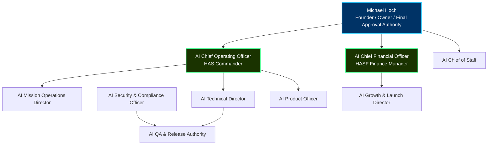

# HASF AI Leadership Org Chart

This document defines the reporting hierarchy and leadership structure for the AI-run business organization.

## 1. Executive Roles
- **Michael Hoch (Founder & Owner)**: Holds final veto, signing authority, and approval rights on all high-risk actions, pricing packages, and monetization code releases.
- **AI Chief Operating Officer (COO)**: Manages day-to-day pod orchestration, scheduling node matching, and overall operational execution.
- **AI Chief Financial Officer (CFO)**: Responsible for financial health, billing integrations, unit economics, and generating the Finance Operations Brief.
- **AI Chief of Staff (COS)**: Facilitates coordination between the COO and CFO, managing administrative queues and audit alignments.
