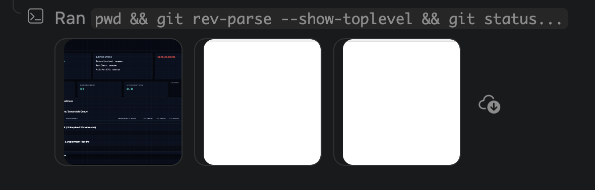
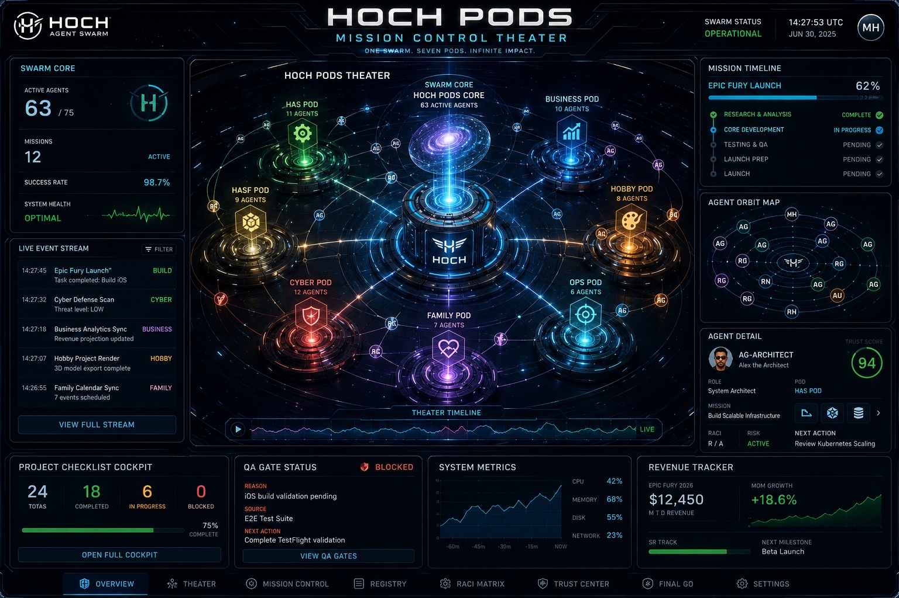

# Approved Visual Authority Review

**Doctrine**: HOCH_PODS_VISUAL_AUTHORITY_NO_VARIANCE
**Status**: LOCKED
**Date**: 2026-07-02
**Workspace**: /Users/michaelhoch/hoch_agent_swarm

## 1. Control Plane Authority

**Canonical Path**: `docs/design/approved-visual-authority/hoch-control-plane-authority.png`  
**Expected SHA256**: `2cb2aa32d7d449b187ef0e391309433ec66477edee1b6b3b4a449bcadef6b8c2`  
**Actual SHA256**: `2cb2aa32d7d449b187ef0e391309433ec66477edee1b6b3b4a449bcadef6b8c2`  
**Hash Match**: YES  
**Allowed Use**: UI control plane, product-card visual language, task-run visual language, operator control styling  
**Doctrine Status**: APPROVED CANONICAL AUTHORITY

## 2. Hoch Pods Theater Authority

**Canonical Path**: `docs/design/approved-visual-authority/hoch-pods-theater-authority.jpeg`  
**Expected SHA256**: `98daa2b07b0a6ed71429b4d34afd69e7d54fc22c933002f1189a56eef676c1b4`  
**Actual SHA256**: `98daa2b07b0a6ed71429b4d34afd69e7d54fc22c933002f1189a56eef676c1b4`  
**Hash Match**: YES  
**Allowed Use**: Hoch Pods Mission Control Theater, agent lift-off, agent spin-up, agent orbit, task traversal, mission timeline, pod docking, landing, securing agents into Hoch Pods, final GO / NO-GO theater panels  
**Doctrine Status**: APPROVED CANONICAL AUTHORITY

**Michael, please visually inspect these images in VS Code or Finder to confirm they match the approved doctrine images. Do not proceed to runtime changes until you approve this review.**

**Import Source Confirmed**: hoch-approved-visual-authority 2/ (with exact hash match after copy)
**PHASE 4 COMPLETE** - Review files created. Awaiting visual confirmation before PHASE 5+.
