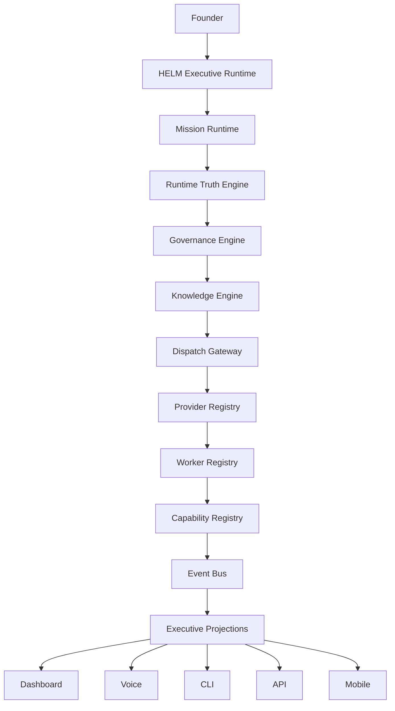
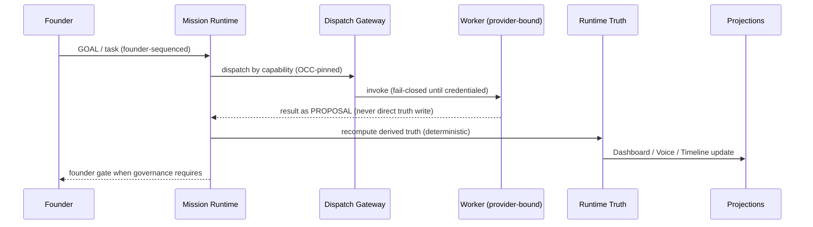

# HELM CONSTITUTION v1.0

### The Authoritative Constitutional Baseline (ACB) for the HOCH Agent Swarm

```
Status:        RATIFIED (architecture & governance approach)
Founder:       Michael Hoch — 2026-07-17
Baseline:      AUTHORITATIVE
Architecture:  FROZEN
Governance:    ACTIVE
Version:       1.0
Platform:      HELM Executive Operating System v1.0.0-alpha
Modifications: EDRs only (Article IX)
Verification:  PENDING — implementation/repository conformance is OUTSIDE the scope of this ratification
```
> Ratified 2026-07-17. The founder ratifies the **architecture and governance approach**, and
> explicitly does **not** certify that the implementation or repository conforms to it —
> implementation verification remains pending (preserves No Fake Green). This baseline supersedes
> all previous architectural descriptions and changes only by EDR (Article IX).
> Decision record: `FOUNDER_RATIFICATION.md`.

> **Normative reference.** This document is the single source of architectural
> truth for HELM. Ratified by Michael Hoch, 2026-07-17. From this point forward,
> future work **references this document** rather than restating the architecture.
> The architecture is **frozen**; it changes **only through a governed EDR**.
> Runtime, factories, providers, and models evolve — HELM's architecture does not
> drift except through formal governance.

> **Scope of the Builder's mission (per founder directive 2026-07-17):** *not*
> to redesign HELM, but to **freeze, normalize, implement, and operationalize**
> the architecture already defined. This is specification-driven engineering.

---

## Article 0 — Nature of HELM

HELM is not a chatbot, and not an orchestrator prompt. **HELM is an Executive
Runtime** — a governed, evidence-first executive operating system. The founder
works through HELM; everything else (frontier models, local models, factories,
voice, dashboards) is a **service** or a **replaceable backend**. Frontier and
local models are interchangeable execution engines behind the runtime; provider
names are implementation details.

**North Star environment:** `~/hoch_agent_swarm` is the single authoritative
workspace. No separate systems, no duplicated state, no competing truth.

---

## Article I — The Constitutional Layer Stack (FROZEN)



No layer may be added, removed, or re-scoped without an approved EDR under
`docs/helm/edr/`.

### Layer Register — honest implementation status (NO FAKE GREEN)

| # | Constitutional Layer | Status | Implementation / evidence |
|---|---|---|---|
| 1 | **HELM Executive Runtime** (platform, not an actor) | IMPLEMENTED | `backend/helm_runtime/` + `backend/helm_live_api.py` (mounts bridge) |
| 2 | **Mission Runtime** | IMPLEMENTED | `mission_runtime.py`, `transaction.py` (BEGIN→END + OCC/CAS), `mission_store.py`; tests green |
| 3 | **Runtime Truth Engine** | PARTIAL | `truth_engine.py` + `backend/truth/{hmai,external_milestones,integrity,evidence_chain,supply_chain,authority_binding}.py` |
| 4 | **Governance Engine** | IMPLEMENTED | `governance_engine.py` + `coordination/governance/field_ownership.json` (founder gates, field ownership) |
| 5 | **Knowledge Engine** | **PLANNED** | no module yet — organizational memory not built |
| 6 | **Dispatch Gateway** | PARTIAL (skeleton) | `dispatch_gateway.py` — fail-closed; no live dispatch; no credentials (EDR-0002) |
| 7 | **Provider Registry** | IMPLEMENTED | `role_bindings.json` + `provider_router.py`; adapters are skeletons |
| 8 | **Worker Registry** | PARTIAL | 3 roles bound (orchestrator/builder/auditor); extended roster (cyber, research, factories…) DESIGNED |
| 9 | **Capability Registry** | IMPLEMENTED | `capability_registry.json` + `capability_registry.py` (3 roles) |
| 10 | **Event Bus** | IMPLEMENTED | `event_bus.py` — append-only JSONL, fsync, replayable |
| 11 | **Executive Projections — Dashboard** | IMPLEMENTED | `frontend_live/ops_center.html` at `/ops`; `executive.html` |
| 11 | **Executive Projections — API** | IMPLEMENTED | `bridge_api.py` read-only endpoints |
| 11 | **Executive Projections — Voice** | PARTIAL | `backend/voice/router.py`, `frontend_live/voice.html` |
| 11 | **Executive Projections — CLI** | PLANNED | not built |
| 11 | **Executive Projections — Mobile** | PARTIAL | same-origin pages render on phone; no native app |

---

## Article II — Runtime Truth Principles (FROZEN)

1. **Runtime Truth First** — the runtime is authoritative; docs explain, models advise, visuals observe. If they disagree, runtime wins.
2. **Evidence Before Confidence** — every operational claim traces to runtime state · telemetry · evidence · verification · governance.
3. **No Fake Green** — never render green/OK on absent or stale evidence.
4. **Unknown remains UNKNOWN** — no optimistic status; UNKNOWN renders dark, never counted as green.
5. **Fail Closed** — on uncertainty or missing capability, deny/stop rather than pretend (e.g. dispatch raises `DispatchNotEnabledError`).
6. **Derived State + Deterministic Recomputation** — truth is computed from sources, never owned by a model; recomputation is deterministic.
7. **Replayability + Immutable Evidence** — every state change is versioned and event-logged; evidence is append-only.

(Consistent with `HELM_DESIGN_CONSTITUTION.md`, which this Constitution incorporates by reference.)

---

## Article III — Provider Architecture (FROZEN interface)

**Provider classes:** *Frontier* (OpenAI, Anthropic, xAI, Google, future) and
*Local* (Ollama, LM Studio, llama.cpp, vLLM, future). **Routing is strictly by
capability, never by provider preference.** Provider names are implementation
details; HELM owns execution.

### Provider Adapter Contract (frozen surface — bodies are follow-on)

Every provider implements the same interface: `dispatch()`, `stream()`,
`cancel()`, `health()`, `metrics()`, `capabilities()`, `embeddings()`, plus
metadata: reasoning profile, cost, latency, availability. **No provider-specific
logic leaks into HELM.** Current: `ProviderAdapter` ABC in `dispatch_gateway.py`
defines `invoke/stream/cancel/health/capabilities` (skeleton; `metrics/embeddings`
+ metadata are the frozen-but-unimplemented extension, tracked by EDR-0002).

**Local models are first-class citizens** — HELM discovers Ollama/LM Studio/
embedding/vision/coding models and exposes a live capability inventory. *Status:
PLANNED* (LocalAdapter is a fail-closed skeleton keyed on `HELM_LOCAL_MODEL_URL`).

---

## Article IV — Governance (FROZEN)

**Founder-only authorities** (nobody else, ever, without an explicit founder
transaction): money movement · key/secret provisioning · legal acceptance ·
production deployment approval · App Store release · security exceptions.
**Everything else is delegated** and may be autonomous under governance.

Enforced by `governance_engine.py` + `field_ownership.json`. Actors are **Founder,
Orchestrator, Builder, Auditor** only. Runtime and Truth are **platform, not
actors** — truth is derived, owned by no model.

---

## Article V — Registries (FROZEN concept)

- **Provider Registry** — `role_bindings.json`: role → provider/model binding; replace a model by editing the binding, never the architecture.
- **Worker Registry** — roles own execution; workers **never** own Runtime Truth. Frozen roster grows only by governed addition.
- **Capability Registry** — `capability_registry.json`: tasks route by capability → role → binding.

Capability routing (frozen): `Mission → Task → Capability Requirements →
Capability Registry → Eligible Workers → Policy Engine → Dispatch Gateway → Provider`.

---

## Article VI — Cybersecurity Constitution (baseline)

HELM's security posture maps to: **NIST SP 800-53 Rev.5**, **800-37 (RMF)**,
**800-207 (Zero Trust)**, Continuous Monitoring, Configuration Management, Secure
Supply Chain, Cryptographic Integrity, Immutable Audit Logging, Least Privilege,
Defense in Depth, Secrets Management, Signed Evidence, Drift Detection.
**Unknown controls remain UNKNOWN — never infer compliance.**

| Domain | Status | Evidence |
|---|---|---|
| NIST Rev.5 traceability matrix | PARTIAL | `backend/helm/nist_matrix.py` (nist_router) |
| Continuous Monitoring (ConMon) | PARTIAL | `backend/security/helm_conmon.py` |
| Configuration Drift Detection | PARTIAL | `backend/promptops_drift.py` |
| API hardening (authn/CORS/rate-limit) | STAGED (flag-off) | `backend/security/api_hardening.py` |
| Supply-chain / evidence integrity | PARTIAL | `backend/truth/{supply_chain,evidence_chain,integrity}.py` |
| Zero Trust architecture | PLANNED | — |
| Immutable audit logging (AU-9 chain) | PARTIAL | event bus + evidence chain |

---

## Article VII — Continuous Monitoring & Drift (baseline)

ConMon continuously observes (live projections only): Mission Health, Worker
Health, Provider Health, Local-Model Health, Runtime Health, Security Posture,
Evidence Freshness, Configuration Drift, Critical Path, Factory Readiness,
Dispatch Status, Founder Gates. Drift compares Approved Baseline → Current Runtime
→ drift → mission impact → recommended actions → founder notification.
**Architectural drift requires an EDR; operational drift is expected and reported.**
*Status: PARTIAL (`helm_conmon.py`, `promptops_drift.py`); unified ConMon surface DESIGNED.*

---

## Article VIII — Factory Framework

Factories (HASF, HRF, HMF, HSF, Finance, Cyber, Research, Applications, Music,
future) **consume runtime services** and **never duplicate the runtime**.
Factories are **plugins**. *Status: DESIGNED (factory registry exists; plugin
contract to be specified by EDR).*

---

## Article IX — Amendment Process

1. Any architectural change is proposed as an **EDR** under `docs/helm/edr/`.
2. Builder authors; **Auditor independently verifies**; Founder ratifies.
3. On ratification, this Constitution's version increments (v1.0 → v1.1 …) and
   the change is recorded in the Amendment Log below.
4. No layer, interface, or principle above changes by any other path.

### Amendment Log
- **v1.0 (2026-07-17)** — initial ratification; freezes the layer stack, truth
  principles, provider/adapter contract, governance, registries, and the
  cybersecurity baseline.

---

## Article X — Platform Stability

The Constitutional Baseline exists to **maximize long-term platform stability**.
Future work **shall**: extend capabilities · improve implementation · increase
automation · improve verification · improve security · improve usability.
Future work **shall not** redefine constitutional architecture except through the
formal amendment process (Article IX). Models, providers, factories, and features
evolve; the constitutional architecture does not. **This article protects HELM
from architecture churn.**

---

## Normalization Register (working — resolved via EDR, not redesign)

These are **normalization** tasks (freeze/dedupe/resolve), not new architecture:

| Item | Issue | Resolution |
|---|---|---|
| Duplicate EDR-0001 | `EDR-0001-executive-runtime-four-engines.md` and `EDR-0001-runtime-bridge.md` share a number | Renumber one (EDR-000X) via governed edit |
| Two `/api/v1/helm/mission` routes | bridge router + `helm_live_api.py` both define it | Converge on the bridge projection; deprecate the duplicate |
| `verification_target_id` fork | ids `ae02a1b5 → 20afc264 → …` minted by parallel actors | Hash **implementation only** (code+config+tests); EDRs reference, not hashed |
| Terminology | "Provider Registry" vs `provider_router`, "Runtime Truth Engine" vs `truth_engine.py` | Adopt Constitutional names as canonical; code aliases documented |

---

## Article XI — Deliverables Register (governed checklist, not a redesign)

| Deliverable | Status | Location |
|---|---|---|
| HELM Constitution v1.0 | **THIS DOCUMENT** | `docs/helm/HELM_CONSTITUTION_v1.0.md` |
| Runtime Specification | PARTIAL | `HELM_MISSION_RUNTIME_ARCHITECTURE.md` + code |
| Dispatch Gateway / Provider Adapter Spec | PARTIAL | `EDR-0002` + Article III |
| Event Bus Specification | PARTIAL | `event_bus.py` + Article I |
| Worker Specification | PLANNED | — |
| Knowledge Engine Specification | PLANNED | — |
| Cybersecurity Baseline / NIST Rev.5 matrix | PARTIAL | Article VI + `nist_matrix.py` |
| Zero Trust Architecture | PLANNED | — |
| ConMon / Drift Detection Design | PARTIAL | Article VII |
| Executive Operations Center Design | IMPLEMENTED | `frontend_live/ops_center.html` (`/ops`) |
| Voice Architecture | PARTIAL | `backend/voice/`, `voice.html` |
| Factory Plugin Architecture | DESIGNED | Article VIII |
| Mermaid / sequence / state / class diagrams | PARTIAL | Article I (stack) + Appendix A |
| EDRs | ONGOING | `docs/helm/edr/` (EDR-0001, EDR-0002) |

---

## Article XII — Success Criteria (acceptance gates + current status)

| Criterion | Status |
|---|---|
| One authoritative constitutional baseline | ✅ this document (v1.0) |
| `~/hoch_agent_swarm` is the single operational environment | ✅ enforced by convention |
| Frontier + local models interchangeable via adapters | 🟡 registry + skeleton; live dispatch PLANNED |
| All collaboration via Mission Runtime / Event Bus / Knowledge / Runtime Truth | 🟡 runtime + event bus live; Knowledge PLANNED; enforcement to strengthen |
| ConMon + Zero Trust + NIST baseline integrated | 🟡 PARTIAL |
| Executive Operations Center is the single interface | ✅ `/ops` built; to be made the default landing |
| Future work extends via governed EDRs, not redefinition | ✅ mandated by Article IX |
| HELM is the stable OS; models/providers/factories replaceable | ✅ architecturally; enablement founder-gated |

---

## Appendix A — Mission execution sequence (frozen flow)



---

*End of HELM Constitution v1.0. Amendments only via EDR (Article IX).*
