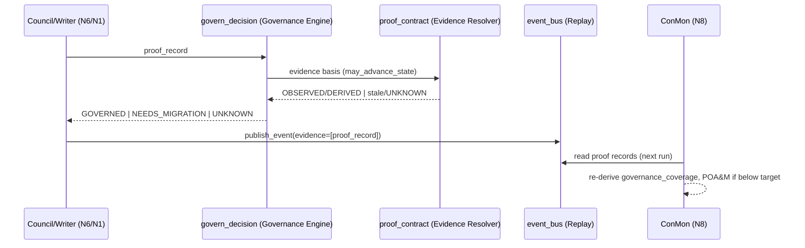

# HELM Runtime Architecture v1 — the Constitutional Runtime (engineering specification)

> HELM-GOV | extends: `docs/helm/HELM_MISSION_RUNTIME_ARCHITECTURE.md` (four-engine substrate) | doctrine: Governance-before-Capability | edr: EDR-0006 (R1–R10) | why: canonical engineering spec for the governance integration layer; every named component cites the real module that implements it (Founder Directives #3, #4, #5).

**Status:** Specification (2026-07-18). Adopted by EDR-0006. **This is an engineering specification,
not user documentation.**

**Foundational statement:** The **Constitutional Runtime is not a new runtime.** It is the governance
integration layer that composes and governs HELM's *existing* runtime through a single authoritative
governance path. Objective: **governed runtime, not more runtime** — Integrate · Simplify · Govern ·
Continuously Prove. No fictional components appear below; each names a real repository module.

---

## 1. Architecture overview
HELM's substrate is the four-engine Executive Runtime (`backend/helm_runtime/`: Mission Runtime,
Runtime Truth Engine, Governance Engine, Event Bus) plus the N1–N8 PERT subsystems
(`coordination/goal/helm_pert.json`). The Constitutional Runtime adds **one primitive** (the Proof
Record) and **one authoritative entry point** (`governance_engine.govern_decision`) that every
material decision resolves through. Nothing is replaced; existing gates become *callers* of the one
gate.

```
Founder ─ Constitution v1.0 (frozen) ─ Engineering Doctrine v1.0
                                              │  adopted by EDR-0006
                                              ▼
                         Runtime Governance  =  governance_engine.govern_decision()
        ┌───────────────┬──────────────┬───────────────┬─────────────┐
   Knowledge Engine  Governance    Proof Contract   Truth Engine   Event Bus
   (N5, resolves     Engine (N1,   (Evidence        (derives       (replayable
    Constitution+     the gate)     Resolver,        truth)         proof log,
    EDRs)                           delegates here)                  evidence[])
        └───────────────┴──────────────┴───────────────┴─────────────┘
                                    │
                         Factories · Mission Control · Governance Replay
```

## 2. Component responsibilities (real modules only)

| Component (doctrine name) | Real module | Responsibility | Change |
|---|---|---|---|
| Constitution v1.0 | `docs/helm/HELM_CONSTITUTION_v1.0.md` | Frozen constitutional baseline | Untouched (Directive #12) |
| Engineering Doctrine | `docs/helm/HELM_ENGINEERING_DOCTRINE_v1.md` | The doctrine text | New doc |
| Runtime Governance (the gate) | `backend/helm_runtime/governance_engine.py` → `govern_decision()` | Single authoritative validate+classify of a Proof Record | **Extend** (R2) |
| Proof Record primitive | `backend/helm_runtime/governance_manifest.py` | Schema + validator for the Proof Record | **New** (R1, only new module) |
| Constitutional Resolver | `backend/helm_runtime/knowledge_engine.py` (N5) | Governed load of Constitution + applicable EDRs | Reuse |
| Evidence Resolver | `backend/security/proof_contract.py` + `backend/truth/evidence_chain.py` | Evidence basis; delegates governance to the gate | **Extend** (R3) |
| Compliance Monitor | `backend/security/helm_conmon.py` (N8) | Continuous governance-coverage proof + POA&M | **Extend** (R7) |
| Truth Engine | `backend/helm_runtime/truth_engine.py` | Derives projections from evidence | Reuse |
| Event Bus / Governance Replay | `backend/helm_runtime/event_bus.py` | Append-only replayable log; carries Proof Record in `evidence[]` | **Extend** (R5) |
| Dispatch (N6) | `scripts/council/gateway.py`, `backend/dispatch/council_router.py` | Emits Proof Record via the gate on new decisions | **Extend** (R4) |
| Factories | `backend/factory/registry.py`, `coordination/council/factory_registry.json` | Inherit governance gate-set | **Extend** (Phase 3) |
| Mission Control | `backend/mission_control/` + `backend/helm_runtime/mission_runtime.py` / `transaction.py` (N1) | AUTHORIZE step routes through the gate | Reuse/route |

## 3. Runtime interfaces
- `govern_decision(proof_record: dict) -> GovernanceResult` — the one gate. Returns
  `{governance_state, missing[], evidence_class}`. Pure/deterministic; no side effects beyond an
  optional event emission by the caller.
- `governance_manifest.validate(proof_record) -> (ok: bool, missing: list[str])` — schema check.
- `proof_contract.may_advance_state(..., proof_record=None)` — delegates governance to
  `govern_decision`; keeps the Evidence Doctrine controls as the evidence basis.
- `event_bus.publish_event(..., evidence=[proof_record])` — replayable proof.

## 4. Governance chain (data flow, one material decision)
```
Decision proposed (council / write path / factory)
  → build Proof Record (reuse correlation_id, digests, tested_commit, evidence_class)
  → governance_engine.govern_decision(proof_record)
        GOVERNED        → may advance state
        NEEDS_MIGRATION → recorded, cannot advance (legacy path)
        UNKNOWN         → recorded, cannot advance (fail-closed, Phase 1)
  → event_bus.publish_event(evidence=[proof_record])   # replay
  → truth_engine.recompute_projections()               # derived truth
  → N8 ConMon re-derives governance_coverage next run   # continuous proof
```

## 5. Proof Record schema (canonical — single definition in `governance_manifest.py`)
```json
{
  "authorized":      {"authority": "str", "decision_id": "str", "gate": "str"},
  "explanation":     "str (one line: why this decision)",
  "trace":           {"correlation_id": "str", "input_digests": ["sha256"]},
  "proven":          {"proof_command": "str", "exit_code": 0, "evidence_hash": "sha256"},
  "audit":           {"record_hash": "sha256", "prev_hash": "sha256|null"},
  "reproducibility": {"tested_commit": "str", "environment": "str"},
  "evidence_class":  "OBSERVED|DERIVED|CACHED|ASSERTED|UNKNOWN",
  "governance_state":"GOVERNED|NEEDS_MIGRATION|UNKNOWN"
}
```
Required for `GOVERNED`: all six property blocks populated **and** `evidence_class ∈ {OBSERVED,DERIVED}`.

## 6. Runtime invariants
- **INV-1 (single gate):** exactly one function classifies governance state (`govern_decision`). No
  parallel gate. Enforced by a structural test (AC-2).
- **INV-2 (fail-closed, new):** a new material decision without a valid Proof Record is `UNKNOWN` and
  cannot advance state.
- **INV-3 (no silent promotion):** legacy `NEEDS_MIGRATION`/`UNKNOWN` never becomes `GOVERNED` except
  via an explicit migration record.
- **INV-4 (append-only truth):** classification/migration never rewrite historical hash-chained ledgers.
- **INV-5 (no theater):** only OBSERVED/DERIVED contribute to `governance_coverage`.
- **INV-6 (Constitution frozen):** the Constitution file is byte-unchanged by this work.

## 7. Failure modes
| Failure | Behavior | Recovery |
|---|---|---|
| Proof Record missing fields | classify `UNKNOWN`, record, do not advance; daemon continues | supply fields / migrate |
| `govern_decision` raises | fail-closed: treat as `UNKNOWN`, log to event bus | fix caller; never default to GOVERNED |
| Legacy record read w/o Proof Record | read succeeds; state = `NEEDS_MIGRATION` | Phase 2 classify → Phase 3/4 migrate |
| Evidence stale (CACHED) | not GOVERNED (Evidence Doctrine freshness) | re-observe |
| ConMon below target | POA&M emitted; coverage trend flagged | remediate to raise coverage |

## 8. Sequence diagrams


## 9. Extension points
- Add a decision source → build a Proof Record and call `govern_decision`; do **not** add a gate.
- Add a factory → declare its gates (registry inherits `GOVERNANCE_GATES`); no engine change.
- Tighten enforcement → Phase 4 flips `govern_decision` from new-only to global (founder gate).

## 10. Service ownership (roles, per `field_ownership.json`)
- **Builder** owns: `governance_manifest.py`, `govern_decision`, the gate wiring, tests, this spec, EDRs.
- **Governance Engine (platform)** owns: authorization decisions, policy violations (not an actor).
- **Auditor** owns: independent verification of the acceptance criteria (EDR-0006 §Verification).
- **Founder** owns: EDR-0006 ratification, the Phase 4 global-enforcement gate, all money/publish gates.

## 11. Future Runtime v2 considerations
- Promote the Proof Record to a signed, content-addressed object (extend `evidence_chain.py`).
- Move `govern_decision` behind a stable RPC so non-Python workers call the same gate.
- Auto-migration agents that raise legacy `NEEDS_MIGRATION` → `GOVERNED` under Auditor sign-off.
- Governance replay UI over `event_bus` (projection-only), reconstructing any decision from its Proof
  Record alone.

## 12. Traceability
Every implementing file carries a `HELM-GOV` marker (EDR-0006-R9). Diagram: see
`docs/helm/HELM_CONSTITUTIONAL_RUNTIME_ARCHITECTURE.svg`.
