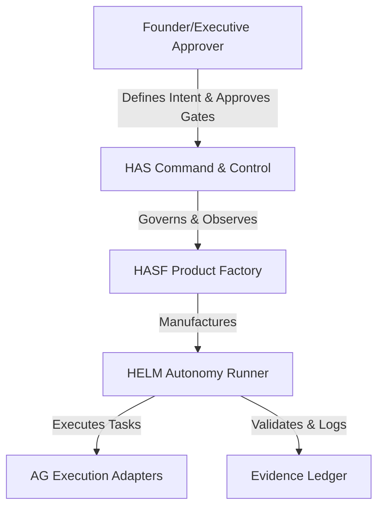

# HAS/HASF End-Goals Lock

This document locks the structural definition and goals of the HAS/HASF swarm architecture.

---

## 1. System Components & Governance Hierarchy

* **HAS**: 24/7 autonomous command-control runtime. Owns registry, queue states, and security observation.
* **HASF**: 24/7 autonomous product factory. Selects candidates, maps backlogs, schedules pipeline stages.
* **HELM**: Persistent AI model runner and execution daemon. Resolves tasks from queue, interfaces model providers.
* **AG**: Execution adapter helper. Executes individual actions within the sandbox (reads, writes, calls).
* **Michael**: Founder authority. Reviewer of safety gates, release posture, and monetization.

---

## 2. Lock Policies
* **Autonomy Rule**: No agent execution steps or task loops require manual human invocation.
* **Tamper-Evident Rule**: All runtime modifications must be logged in the evidence manifest.
* **Gate Lock**: Release and monetization changes remain strictly human-in-the-loop.
