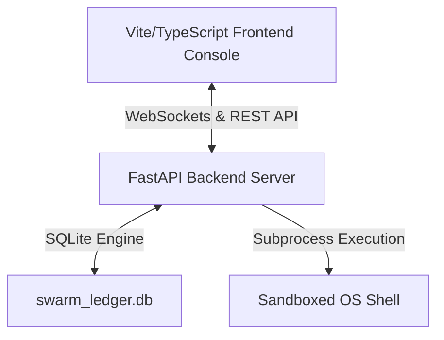
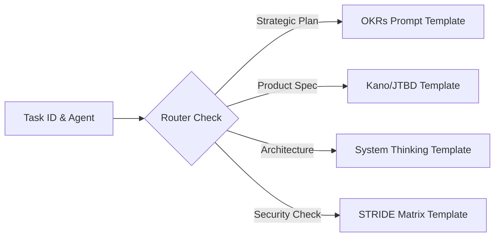

# System Architecture Reference — HOCH Swarm Console

**Document ID**: ARCH-REF-2026-06-25  
**Frameworks**: Systems Thinking, Tradeoff Analysis  
**Author**: System Architecture Agent  

---

## 1. Overall System Architecture
The system follows a decoupled Client-Server architecture designed to run on the local host with secure sandbox borders.



---

## 2. Component Boundaries

### A. Frontend Console Component
- **Path**: `frontend/`
- **Responsibility**: Provides the graphical operator interface, renders task graphs, provides the Swarm Approval Queue, and visualizes individual agent trading cards.
- **Entrypoints**:
  - `frontend/index.html`: Main DOM structure.
  - `frontend/app.js`: State management, event handlers, WebSocket streaming client, and SVG stick figure generators.
  - `frontend/styles.css`: Styles, glassmorphic filters, and 3D card animations.

### B. Backend Service Component
- **Path**: `backend/`
- **Responsibility**: Manages task executions, authenticates command approvals, generates OTel-compatible traces, and exposes WebSocket feeds.
- **Entrypoints**:
  - `backend/main.py`: FastAPI server router, WebSocket broker, and JSON endpoints.
  - `backend/agent_runner.py`: Orchestrates subprocess calls, reads registry, updates status.
  - `backend/cluster_manager.py`: Manages network worker node state.
  - `backend/security_auditor.py`: Runs baseline checks, audits commands.

---

## 3. Database Schema Layout (`swarm_ledger.db`)
SQLite acts as the persistent store with WAL (Write-Ahead Logging) enabled.

### Table: `swarm_ledger`
Records sequential, cryptographically linked transactions to maintain audit integrity.
```sql
CREATE TABLE swarm_ledger (
    block_id INTEGER PRIMARY KEY AUTOINCREMENT,
    timestamp TEXT NOT NULL,
    actor TEXT NOT NULL,
    action TEXT NOT NULL,
    target TEXT NOT NULL,
    result TEXT NOT NULL,
    evidence TEXT NOT NULL,
    hash TEXT NOT NULL,         -- SHA256 of current block fields
    prev_hash TEXT NOT NULL     -- SHA256 of the prior block
);
```

### Table: `hochster_jobs`
Tracks state and outcome of automated worker executions.
```sql
CREATE TABLE hochster_jobs (
    job_id TEXT PRIMARY KEY,
    name TEXT NOT NULL,
    status TEXT NOT NULL,
    start_time TEXT NOT NULL,
    end_time TEXT,
    evidence_refs TEXT          -- JSON array string of trace references
);
```

---

## 4. Framework Router Architecture
The router selects the prompt template based on category metadata:


- Prompt contexts are injected dynamically into the LLM system prompt envelope.
