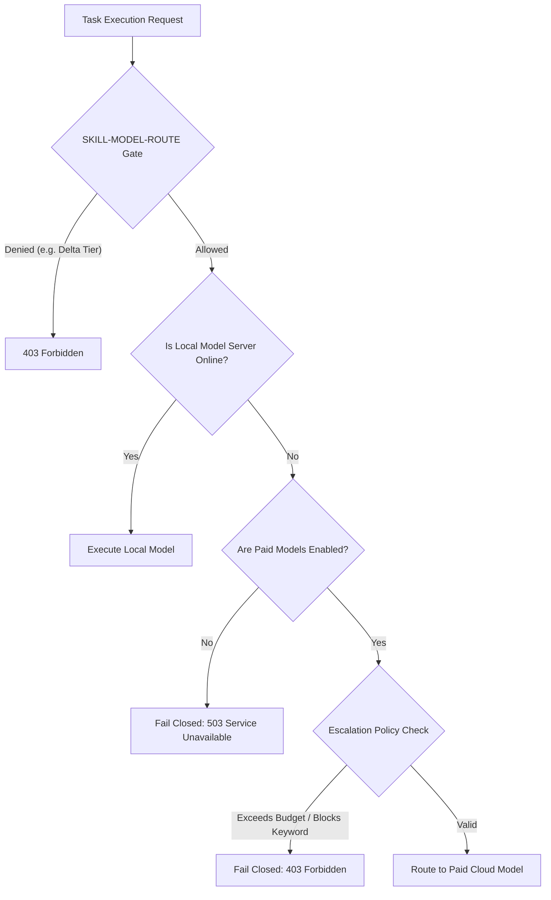

# Local-First AI Governance Doctrine

## 1. Executive Summary

This doctrine defines the policy, routing contract, and security controls governing model execution within the **HOCH Agent Swarm**. It establishes a secure, local-first computing model that prioritizes privacy, predictability, and local execution, with strictly controlled cloud-based escalation paths.

---

## 2. Core Pillars

### I. The Local-First Mandate
All model execution tasks MUST target local resources first. Valid local engines include:
- **Ollama** running locally on Alpha/Beta/Gamma nodes.
- **LM Studio** local endpoint servers.
- Mock/Safe fallback layers for isolated verification environments.

Under no circumstances should user prompts or operational data be transmitted to third-party cloud APIs unless the Escalation Policy explicitly permits it.

### II. Paid Cloud Escalation Gating
Paid model escalation (e.g. to OpenAI, Anthropic, or Google Gemini cloud APIs) is:
- **Disabled by default** (`paid_models_enabled: false`).
- **Enforced at $0.00 budget** to prevent runaway api costs.
- **Protected by a strict keyword gate** that rejects phrases containing high-risk words (such as `delete`, `password`, `rmf`) or administrative operations.

### III. Node Trust Tier Gating
The routing system is classified under the `SKILL-MODEL-ROUTE` skill definition:
- **Alpha, Beta, Gamma nodes**: Permitted to route and execute.
- **Delta nodes** (e.g., iPhone/iPad monitors, edge collection nodes): **Denied execution access** to protect the integrity of the routing ledger.

### IV. Immutable Audit Ledger
Every routing decision, prompt validation, and model execution result is recorded as a structured JSON Lines entry in the audit trail at `audit/model_routing.jsonl`.

---

## 3. Response Contract & Routing Hierarchy

### API Error Posture (Safe Fail-Closed)

When local engines are offline, and paid escalation is disabled or blocked, the API **must fail closed** rather than leaking data:
- **HTTP 503 (Service Unavailable)**: Returned when no local model provider is available.
- **HTTP 403 (Forbidden)**: Returned if the request violates the escalation policy (e.g. exceeds budget, contains blocked keywords) or fails the skill gate.

---

## 4. Operational Controls & Registry

Configured and enforced via:
- `config/models.yaml` (Local/paid providers and default model configurations)
- `config/escalation.yaml` (Escalation parameters and keyword filters)
- `config/skill_registry.json` (Gating `SKILL-MODEL-ROUTE` access)
