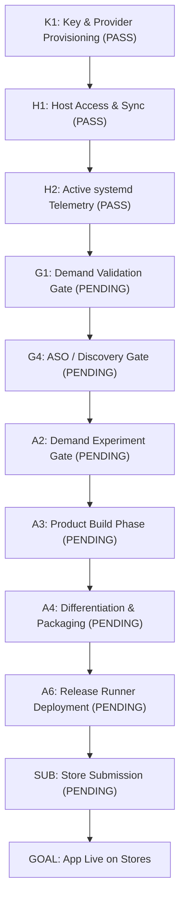

# CONSUMER APP STORE PERT TO GOAL

This document outlines the PERT graph and critical path to target a live app on both Apple App Store and Google Play under the strict consumer-only strategy.

---

## 1. Task Dependency Graph



---

## 2. Track & Gate Compliance

All tasks are mapped to canonical tracks `[R, K, A, B, D]` to ensure automated policy checkers pass.

| Task ID | Track | Name | Enforced Policy / Constraint |
| --- | --- | --- | --- |
| **K1** | K | API Key Provisioning | Founder must add OpenAI/Anthropic keys |
| **H1** | K | Host Verification | ssh access and workspace sync verified |
| **H2** | K | systemd Supervision | telemetry verify check |
| **G1** | R | Demand Validation Gate | Target user, problem, and success threshold defined |
| **G4** | R | ASO / Discovery Gate | Keywords, competitor set, metadata hypothesis |
| **A2** | A | Demand Experiment Gate | Pre-build cheap landing page or waitlist check |
| **A3** | A | Build Phase | Enforce build lock |
| **A4** | A | Differentiation Gate | Apple 4.3 and Google repetitive-content check |
| **A6** | A | Release Runner | Production compilation and signing |
| **SUB** | B | App Submission | Founder-managed credentials and submission |
| **GOAL** | B | App Live on Stores | Verified public store entries |

---

## 3. Critical Path

```
K1 (PASS) → H1 (PASS) → H2 (PASS) → G1 (PENDING) → G4 (PENDING) → A2 (PENDING) → A3 (PENDING) → A4 (PENDING) → A6 (PENDING) → SUB (PENDING) → GOAL
```
**Current Blocker**: **`G1`** (Demand Validation Gate).
