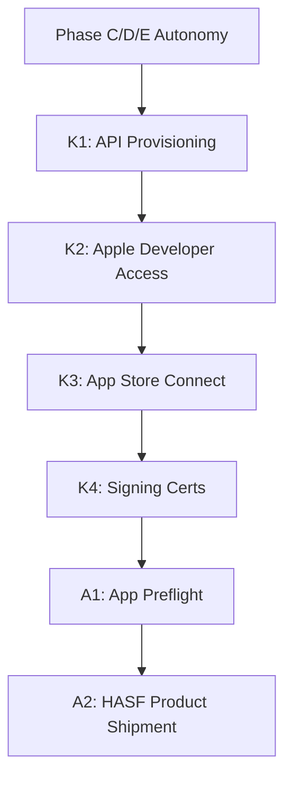

# Three-Lane PERT Reconciliation

This document presents the reconciled task graph integrating all lanes under HELM's sole orchestration.

## Track Tags

- **R**: Runtime Proof / Phase E Autonomy
- **K**: K-Track Founder Ledger
- **A**: App Store / Monetization Preflight
- **B**: Business / Pricing
- **D**: Drift / Scope Locking

## Unified Critical Path

## Track Dependencies

1. **R-Track to K-Track**: Phase E runner autonomy provides the runtime governance to safely process founder credential changes.
2. **K-Track to A-Track**: TestFlight builds and App Store preflight checks require bundle registration (K3) and signing profiles (K4).
3. **A-Track to Shipment**: Product release is blocked until the final preflight compliance checks pass.
