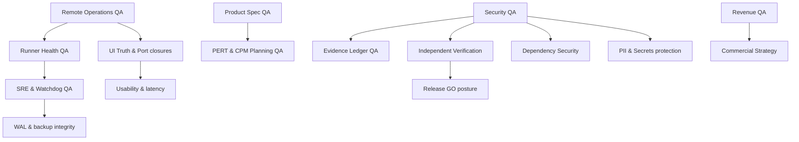

# HAS/HASF QA Task Tree

* **Goal**: Establish the dependency-driven task breakdown structure for executing all 16 QA team checks.

---

## Dependency Graph

```mermaid
graph TD
    remoteops_qa[Remote Operations QA] --> runner_qa[Runner Health QA]
    remoteops_qa --> ui_truth_qa[UI Truth & Port closures]
    
    product_qa[Product Spec QA] --> planning_qa[PERT & CPM Planning QA]
    
    cyber_devsecops_qa[Security QA] --> evidence_qa[Evidence Ledger QA]
    cyber_devsecops_qa --> ivv_red_team_qa[Independent Verification]
    cyber_devsecops_qa --> supply_chain_qa[Dependency Security]
    cyber_devsecops_qa --> secrets_identity_qa[PII & Secrets protection]
    
    revenue_qa[Revenue QA] --> hasf_commercialization_qa[Commercial Strategy]
    
    runner_qa --> sre_reliability_qa[SRE & Watchdog QA]
    ui_truth_qa --> customer_outcome_qa[Usability & latency]
    sre_reliability_qa --> backup_recovery_qa[WAL & backup integrity]
    ivv_red_team_qa --> release_authority_qa[Release GO posture]
```
