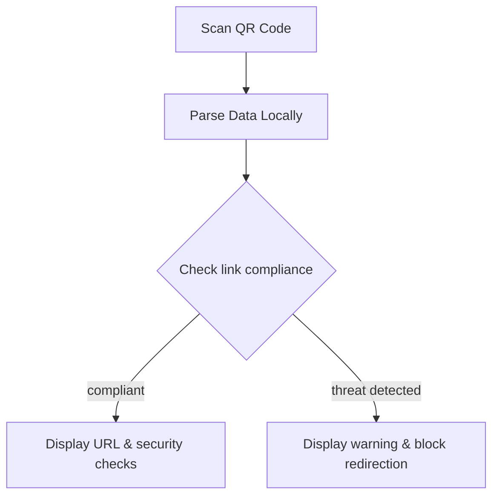

# Product Requirements and User Flows — CyberQRG-AI

---

## 1. Product Purpose
Provide an offline-first QR code security scanner to analyze links for compliance and phishing risks without leaking customer data to third-party APIs.

---

## 2. Target Users
* Security officers operating under strict compliance frameworks.
* Developers needing safe URL parsing.

---

## 3. Workflow Diagrams

---

## 4. MVP Boundaries
* Local-only parsing (no external lookups in R2).
* Simple dark-theme dashboard.
