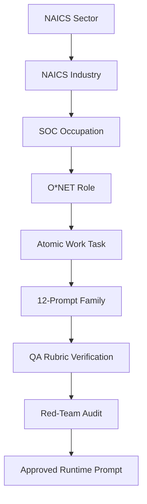
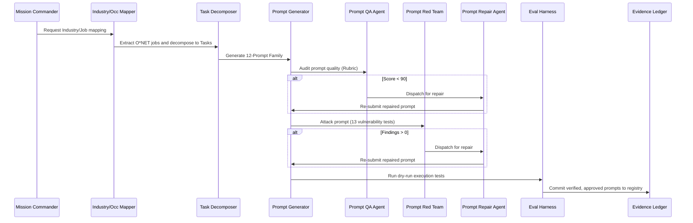

# HOCH Prompt Brain Factory — Architecture

This document describes the design, taxonomy mapping, autonomic execution loop, and runtime dispatch mechanics of the **HOCH Prompt Brain Factory**.

---

## 1. Taxonomic Hierarchy (The Canonical Graph)

The Prompt Brain Factory does not search for or generate prompts randomly. It compiles prompts programmatically using standard industrial and labor taxonomies to map every sector of the modern economy:

### Taxonomy Layers:
1. **NAICS (North American Industry Classification System)**:
   - Sector level (2-digit, e.g., `54` Professional, Scientific, and Technical Services)
   - Subsector/Industry level (4-digit/6-digit, e.g., `541511` Custom Computer Programming Services)
2. **SOC (Standard Occupational Classification)**:
   - Systematically classifies workers into occupational categories (e.g., `15-1252` Software Developers)
3. **O*NET (Occupational Information Network)**:
   - Provides detailed descriptions of the world of work, listing specific tasks, tools, and tech required for each SOC occupation.
4. **Task (Atomic Work Task)**:
   - O*NET activities decomposed into sequential, automated steps.
5. **12-Prompt Family**:
   - For every task, the factory generates a family of 12 distinct prompt templates to handle all execution, compliance, safety, and management perspectives.

---

## 2. The 12-Agent Refinement Loop

The factory operates via a collaborative multi-agent simulation loop:

### Agent Definitions:
* **Mission Commander Agent**: Owns scope, priorities, and convergence boundaries.
* **Industry Mapper Agent**: Builds NAICS industrial hierarchies.
* **Occupation Mapper Agent**: Maps SOC and O*NET occupations.
* **Task Decomposer Agent**: Converts occupations into atomic work tasks.
* **Prompt Generator Agent**: Generates the 12-prompt family for each task.
* **Prompt QA Agent**: Scores prompt quality against the 8-dimension rubric (requires >= 90).
* **Prompt Red Team Agent**: Conducts vulnerability scans against 13 attack vectors (requires 0 critical findings).
* **Prompt Repair Agent**: Automatically diagnoses and fixes failed prompts.
* **Eval Harness Agent**: Runs execution tests across multiple LLM reasoning tiers.
* **Deduplication Agent**: Merges redundant prompts.
* **Evidence Ledger Agent**: Registers all approvals, versions, hashes, and compliance trails.
* **HASF Builder Agent**: Packages approved prompts into reusable runtime tools.

---

## 3. The 12-Prompt Family Schema

For every work task, the Prompt Brain compiles 12 distinct prompts:
1. **Role System Prompt**: Sets up the agent's identity, guidelines, and behavioral boundaries.
2. **Task Execution Prompt**: Directs the agent to perform the specific task step-by-step.
3. **SOP Prompt**: Standard operating procedure, detailing checks and manual fallbacks.
4. **QA Prompt**: Directs a separate agent to verify output quality.
5. **Red-Team Prompt**: Instructs a validator to search for edge cases, failures, or leakage.
6. **Compliance Prompt**: Maps outputs to NIST SP 800-53 controls or NAICS/SOC regulations.
7. **Manager Review Prompt**: Provides a template for human-in-the-loop validation.
8. **Training Prompt**: Explains to new agents or humans how to run the workflow.
9. **Automation Prompt**: Formatted for low-latency JSON-RPC execution.
10. **Evaluation Prompt**: Defines metrics and scoring rules for performance evaluation.
11. **Recovery Prompt**: Standard directives on how to recover if tools, APIs, or models fail.
12. **Mission Prompt**: Maps the task back to the enterprise's overarching objectives.
