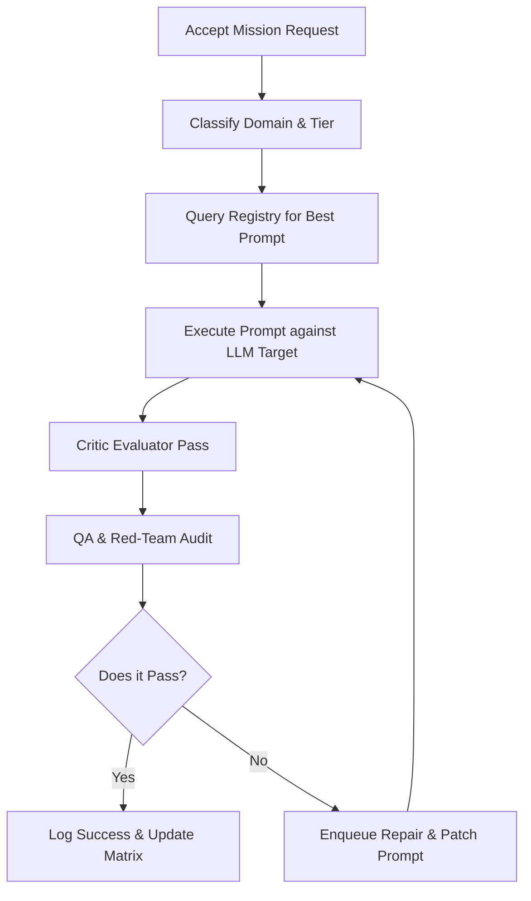

# HOCH Prompt Brain — Runtime Orchestration

This document describes the runtime execution lifecycle, output critiquing, scoring rubric, and API specifications for the **Prompt Brain Runtime Orchestrator**.

---

## 1. Execution Lifecycle

For every mission or task executed within the active swarm, the orchestrator follows this lifecycle:

---

## 2. API Endpoints

The FastAPI backend exposes the following endpoints to dispatch and track runtime orchestrations:

* **GET `/api/v1/prompt-brain/runtime/status`**:
  - Returns current loop health, total executions, and active queues.
* **GET `/api/v1/prompt-brain/runtime/executions`**:
  - Returns all recorded mission execution logs.
* **GET `/api/v1/prompt-brain/runtime/model-performance`**:
  - Returns the metrics matrix (success rate, latency, safety compliance) across tiers.
* **POST `/api/v1/prompt-brain/runtime/execute`**:
  - Parameters: `domain`, `role`, `task`, `family`, `inputs`.
  - Dispatches execution and returns completed record with QA/critic scores.
* **POST `/api/v1/prompt-brain/runtime/repair`**:
  - Parameters: `prompt_id`, `remediation_fixes`.
  - Resolves a pending repair task.
