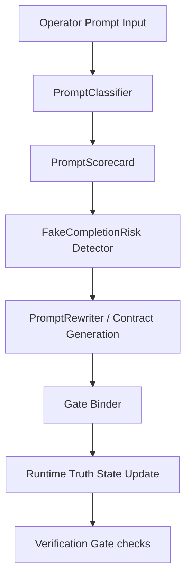

# PromptOps Closure Control Plane Reference

This document outlines the architecture, data flow, and verification lifecycle of the PromptOps Closure Control Plane in the Hoch Agent Swarm (HAS).

## System Flow

