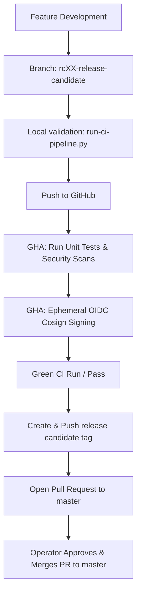

# master Branch Protection and Release Promotion Runbook

This document details the branch protection requirements, status checks, and release promotion policy for the HOCH Agent Swarm repository.

---

## 1. Branch Protection Policy

To guarantee code quality, secure supply chain compliance, and zero-drift runtime enforcement, direct pushes to the `master` branch are strictly prohibited. All changes must be promoted via Pull Requests.

### GitHub Branch Protection Settings

1. **Target Branch:** `master`
2. **Require a pull request before merging:** Enabled
   - **Required approvals:** 1 minimum
   - **Dismiss stale pull request approvals when new commits are pushed:** Enabled
   - **Require review from Code Owners:** Optional (recommended if `CODEOWNERS` is defined)
3. **Require status checks to pass before merging:** Enabled
   - **Status Checks Required:**
     - `Build, Validate, and Sign Release Candidate` (GHA job under the `RC22 CI Enforced Provenance and Observability` workflow)
   - **Require branches to be up to date before merging:** Enabled
4. **Require signed commits:** Enabled (enforces cryptographic verification of all git contributions)
5. **Include administrators:** Enabled (enforces rules on repository owners and admins)

---

## 2. Release Promotion Flow

HOCH Agent Swarm follows a structured candidate-to-release workflow:



### Transition Steps

1. **Candidate Staging:**
   Create a branch `rcXX-branch-name` from the latest green state of `master`.
2. **Integrity Validation:**
   Run the local integration pipeline to ensure zero-drift, valid event schemas, and contract test pass:
   ```bash
   uv run python scripts/qa/run-ci-pipeline.py
   ```
3. **CI Attestation:**
   Push the branch to GitHub. The GHA workflow builds the production Docker image, performs trivy scans, generates CycloneDX SBOM, captures fallback digests, and signs all release assets via ephemeral OIDC tokens.
4. **Milestone Tagging:**
   Once GHA is green, tag the release candidate commit:
   ```bash
   git tag rcXX-branch-name
   git push github refs/tags/rcXX-branch-name
   ```
5. **Master Promotion:**
   Open a Pull Request to merge the release candidate branch into `master`. Once the status checks pass and the operator approves, the PR is merged into `master`.
