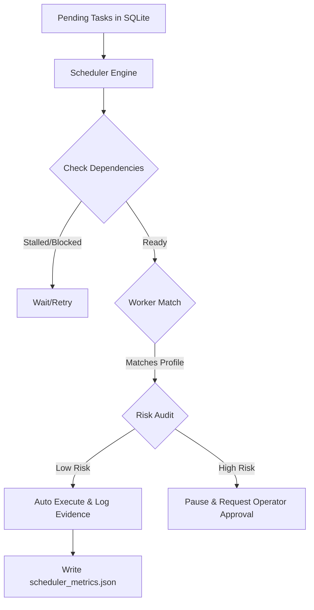

# Runbook: Compute Swarm Scheduler & Resource Utilization (RC33)

## Purpose
This runbook guides operators on managing, monitoring, and auditing the **Compute Swarm Scheduler** designed for heterogeneous compute node scheduling, prioritization of critical-path tasks, and reporting resources utilization.

## Scheduler Architecture
The Swarm Scheduler scans for pending mission steps in `mission_control_tasks`, checks node status via Tailscale/APIs, matches tasks to the optimal worker profiles, executes safe actions autonomously, and leaves high-risk actions pending operator manual approval.



## Operator Controls

### Starting the Dashboard
To start the PERT dashboard and view real-time swarm utilization metrics:
```bash
bash scripts/start_pert_command_center.sh
```

### Running Cadence Loop & Scheduling Tasks
To run the automated cadence loop which checks status, logs metrics, and schedules pending tasks:
```bash
bash scripts/has_autonomous_cadence.sh
```

### Verifying Swarm Isolation
The scheduler respects the hard constraint that public VPS ports must remain closed. Verify with:
```bash
nc -vz -w 5 50.116.41.183 3012
# Expected: Connection timed out / refused
```
