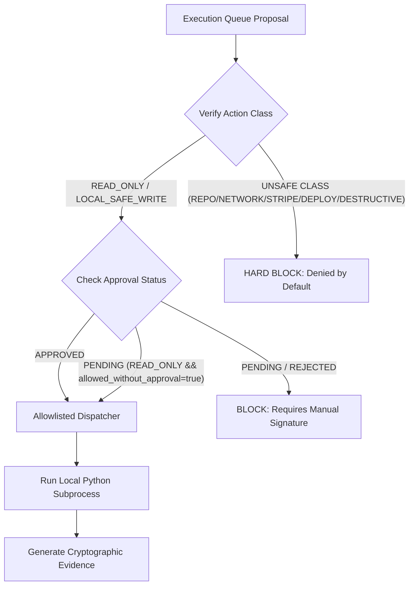

# Swarm Governed Execution Safety Model (NIST-AC-6 Least Privilege)

This document establishes the formal security and safety model for the HAS/HASF Swarm Governed Execution Runner. It details the containment boundaries and cryptographic guarantees preventing unauthorized local or network write actions.

## 1. Zero-Trust Access Bounds

Under zero-trust constraints, all swarm actions are categorized by risk level. Operations that modify code repositories, cross remote networks, access Stripe, or delete data require explicit sign-off by **Michael Hoch (Founder & Owner)**.

The runner strictly partitions actions:

## 2. Dispatcher Allowlist

To prevent Remote Code Execution (RCE) and shell-injection vulnerabilities, the runner forbids arbitrary string compilation or direct shell execution. Instead, it routes all safe tasks through an allowlisted dispatcher containing 11 safe functions:
- `inspect_file_tree`
- `inspect_project_metadata`
- `generate_markdown_brief`
- `refresh_readiness_audit`
- `refresh_revenue_action_queue`
- `refresh_pod_runtime_state`
- `refresh_compute_health`
- `refresh_pod_schedule`
- `refresh_finance_brief`
- `refresh_soccer_audit`
- `validate_no_live_secrets`

## 3. Rollback & Staging Operations

Every staged execution stores the affected filesystem paths and preserves pre-execution states to allow rapid, automated recovery if a validation gate fails post-run.
